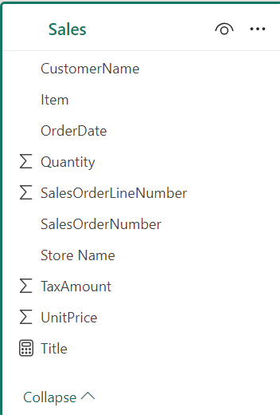
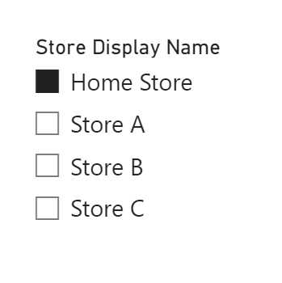
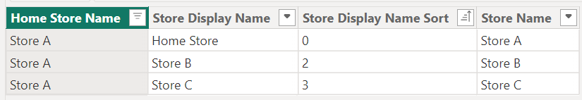
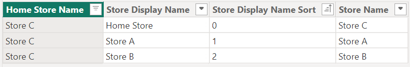
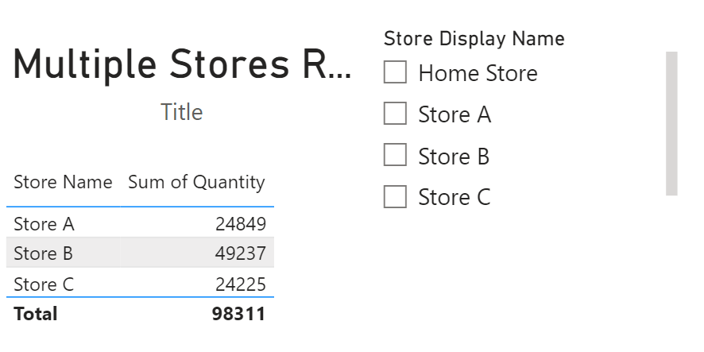
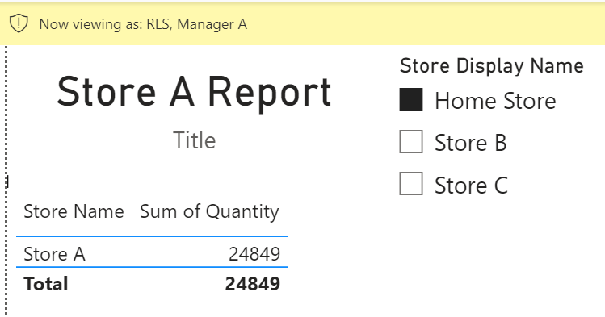
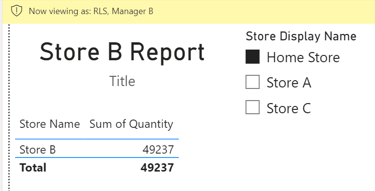
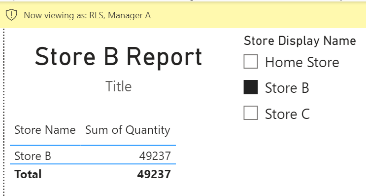
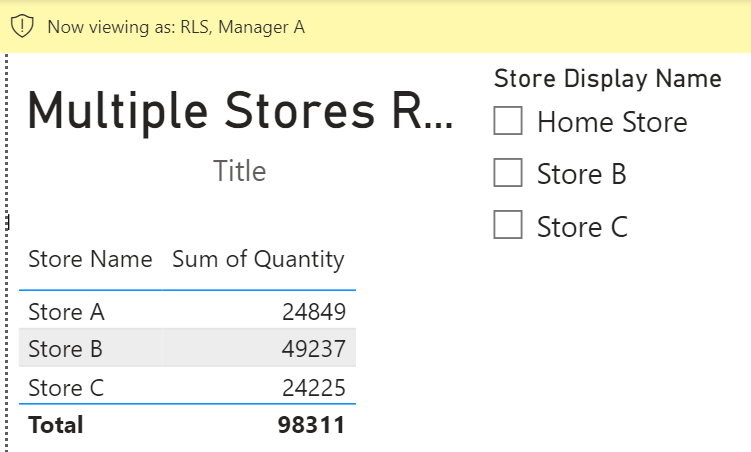

## Introduction

Recently, in an internal Power BI help forum, someone asked if there was a way to force a slicer's default selection to be based on a particular user's sign in.

I thought it was an interesting challenge and wanted to share my proposed solution here.

## The Requirements

The requirements were:

- Users from multiple stores need to all use the same report.
- The users need to see their own store as default when they first open the report.
- The users need to still be able to filter to the other stores.

To simplify the demo, let's assume that the original model consists of one sales table that contains the store name.

## The Solution

My solution was as follows:

**Step 1: Create two additional tables**

1. An RLS table consisting of the user's email address/user principal name and the name of their home store.

2. A table consisting of:
- The cartesian product of store names (Home Store Name and Store Name)
- Store Display Name column whose value is "Home Store" when the Home Store Name is equal to the Store Name
- A Store Display Name Sort column to use as a sort by column for the Store Display Name column.

**Step 2: Create many-to-many, single-direction relationships between the tables.**

**Step 3: Create an RLS rule on the RLS table filtering the user to be equal to the signed in use.**

**Step 4: Add a slicer to the report filtering the Store Display Name to be equal to "Home Store."**

## The Solution Explained

**Simply granting the users access to the report meets the first requirement, "users from multiple stores need to all use the same report."**
The key to fulfilling the second requirements is the Store Display table and the Store Display Name column.

When the user signs in, the RLS table is filtered, and their Home Store Name value is propagated to the Store Display table.

When the Store Display table is filtered to a particular home store, the results are as follows:

- Store A:
    - 
- Store B:
    - 
- Store C:
    - 

Because each employee's home store can be different, selecting a specific value like "Store A" will only meet the requirement for those employees whose home store is "Store A," but not all employees.

Since each Store Name value will be the user's home store when filtering the Store Display Name to be equal to "Home Store," we can add a slicer to the report filtering the Store Display Name to be equal to "Home Store."

When the slicer selection is made, the user's home store value in the Store Name column will propagate down to the Sales table.

As you can see below, employees from different stores (Manager A and Manager B) will see their home store's data when viewing the report because of the slicer selection.

**Requirement 2, "the users need to see their own store as default when they first open the report," has been met.**

Going back to the different possibilities of filtered Store Display tables:

- Store A:
    - 
- Store B:
    - 
- Store C:
    - 

For each possibility above, all store name values exist in the Store Name column.

Since there is a many-to-many relationship between the Store Display table and the Sales table, the filter on the Home Store Name, in effect, does not limit any rows in the sales table, i.e., when no slicer selection is made, all of the Sales data is available.

This allows the user to change the slicer selection from "Home Store" to another value(s).

For example, Manager A, whose home store is "Store A" can see data from other stores.

**Requirement 3, "the users need to still be able to filter to the other stores," has been met.**

## Conclusion

Like always, if you have any questions or feedback, please reach out. I'd love to hear from you!
