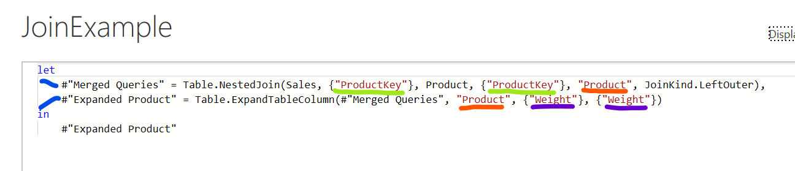
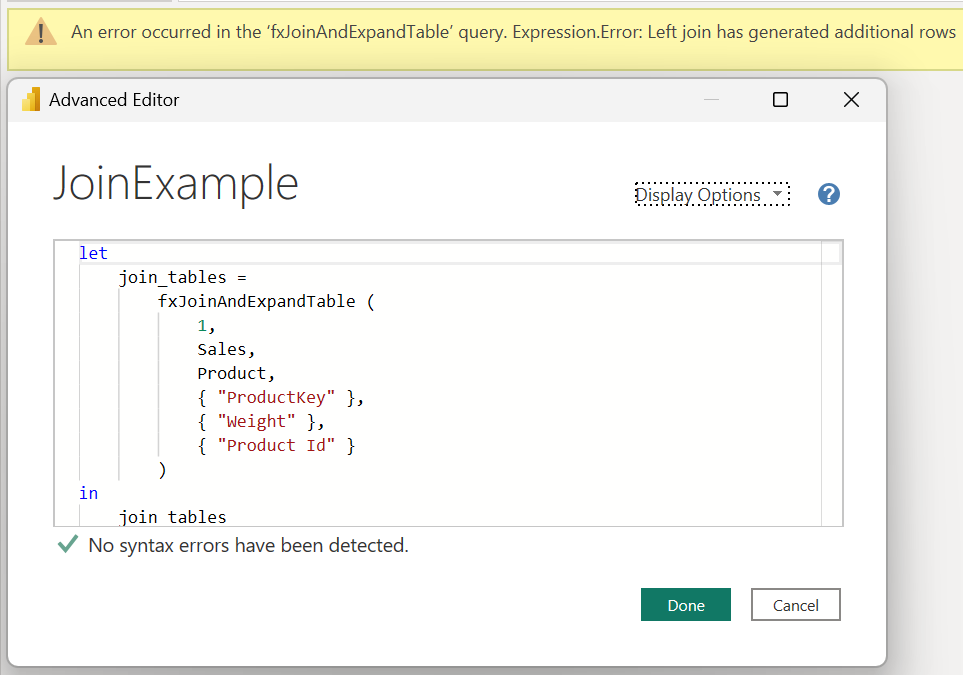

## Introduction

**Click [here](#overview-fxjoinandexpandtable) to go straight to the function.**

If you are doing any type of dimensional modeling in Power BI using Power Query, you are probably very familiar with the "Merge Queries" button that helps the user join two tables together.

Although the GUI is very useful, the resulting code may not be as efficient as it could be, especially if the join columns have the same names and you don't want to rename the columns you are expanding.



Looking at the GUI generated code above, you can see what I am talking about:
Green - The join columns are hard coded even though are both named "ProductKey."
Red - The temporary column generated in the join now has to be maintained in two places even though the value is not important as long as it doesn't already exist in either table.
Purple - The lists of expanded columns and the names of the expanded columns need to be maintained separately, even if they are both the same.
Blue - The operation requires two steps instead of one.

I wrote the function below to help make the address the points above. Also, I added some optional functionality to either guarantee or check that [additional records aren't generated when performing the join.](https://stackoverflow.com/questions/916414/how-can-a-left-outer-join-return-more-records-than-exist-in-the-left-table)

## Overview: fxJoinAndExpandTable

**Purpose:**

This function performs a left join on a source and target table and expands the list of provided columns.

**Parameters:**

**rowIntegritySetting** as number
0. Do nothing. 1. Check to see if the beginning and end row counts are the same in the source table after joining the target table. If not, throw an error. 2. Force a Table.Distinct on the join columns for the target table.

**sourceTable** as table
The source table to be joined to.

**targetTable** as table
The target table to join.

**sourceJoinColumns** as list
The list of column names to join. Must be the same in both tables if targetJoinColumns is null.

**columnsToExpand** as list
The list of column names you want to expand from the target table.

*optional* **targetJoinColumns** as list
Optional list of column names in the target table to join. Leave null if the column names are the same in the source table.

*optional* **alternateColumnsToExpand** as list
Optional list of column names to expand. Columns expanded in columnsToExpand will be renamed to this list when joined.

## Function without documentation

```powerquery
let
    fxFunction =
        (
            rowIntegritySetting as number,
            sourceTable as table,
            targetTable as table,
            sourceJoinColumns as list,
            columnsToExpand as list,
            optional targetJoinColumns as list,
            optional alternateColumnsToExpand as list
        ) as table =>
            let
                _temp_column_name =
                    "_TempJoin",
                _columns_to_join_clean = // use if target join columns different than source join columns
                    targetJoinColumns ?? sourceJoinColumns,
                _columns_to_expand_clean = // use if renaming columns to expand
                    alternateColumnsToExpand ?? columnsToExpand,
                _target_table_clean = // force row integrity on target table
                    if
                        rowIntegritySetting = 2
                    then
                        Table.Distinct (
                            targetTable,
                            _columns_to_join_clean
                        )
                    else
                        targetTable,
                _join_tables = // perform join
                    Table.NestedJoin (
                        sourceTable,
                        sourceJoinColumns,
                        _target_table_clean,
                        _columns_to_join_clean,
                        _temp_column_name,
                        JoinKind.LeftOuter
                    ),
                _expand_join = // expand columns
                    Table.ExpandTableColumn (
                        _join_tables,
                        _temp_column_name,
                        columnsToExpand,
                        _columns_to_expand_clean
                    ),
                _check_row_integrity = // check if the row counts on the source table are the same after joining the target table
                    if
                        rowIntegritySetting = 1 and
                            Table.RowCount ( sourceTable ) <> Table.RowCount ( _expand_join )
                    then
                        error "Left join has generated additional rows"
                    else
                        _expand_join
            in
                _check_row_integrity
in
    fxFunction
```

## Function with documentation

```powerquery
let
    fxFunction =
        (
            rowIntegritySetting as number,
            sourceTable as table,
            targetTable as table,
            sourceJoinColumns as list,
            columnsToExpand as list,
            optional targetJoinColumns as list,
            optional alternateColumnsToExpand as list
        ) as table =>
            let
                _temp_column_name =
                    "_TempJoin",
                _columns_to_join_clean = // use if target join columns different than source join columns
                    targetJoinColumns ?? sourceJoinColumns,
                _columns_to_expand_clean = // use if renaming columns to expand
                    alternateColumnsToExpand ?? columnsToExpand,
                _target_table_clean = // force row integrity on target table
                    if
                        rowIntegritySetting = 2
                    then
                        Table.Distinct (
                            targetTable,
                            _columns_to_join_clean
                        )
                    else
                        targetTable,
                _join_tables = // perform join
                    Table.NestedJoin (
                        sourceTable,
                        sourceJoinColumns,
                        _target_table_clean,
                        _columns_to_join_clean,
                        _temp_column_name,
                        JoinKind.LeftOuter
                    ),
                _expand_join = // expand columns
                    Table.ExpandTableColumn (
                        _join_tables,
                        _temp_column_name,
                        columnsToExpand,
                        _columns_to_expand_clean
                    ),
                _check_row_integrity = // check if the row counts on the source table are the same after joining the target table
                    if
                        rowIntegritySetting = 1 and
                            Table.RowCount ( sourceTable ) <> Table.RowCount ( _expand_join )
                    then
                        error "Left join has generated additional rows"
                    else
                        _expand_join
            in
                _check_row_integrity,
    fxDocumentation =
        type function (
            rowIntegritySetting as (
                type number meta [
                    Documentation.FieldCaption = "Row Integrity Setting",
                    fxDocumentation.AllowedValues = { 0, 1, 2 },
                    Documentation.FieldDescription =
"0.  None - Do nothing.
1. Check Row Integrity - Check to see if the beginning and end row counts are the same in the source table after joining the target table. If not, throw an error.
2. Force Row Integrity - Force a Table.Distinct on the join columns for the target table."
                ]
            ),
            sourceTable as (
                type table meta [
                    Documentation.FieldCaption = "Source Table",
                    Documentation.FieldDescription = "The source table to be joined to."
                ]
            ),
            targetTable as (
                type table meta [
                    Documentation.FieldCaption = "Target Table",
                    Documentation.FieldDescription = "The target table to join."
                ]
            ),
            sourceJoinColumns as (
                type list meta [
                    Documentation.FieldCaption = "Source Join Columns",
                    Documentation.FieldDescription = "The list of column names to join. Must be the same in both tables if targetJoinColumns is null."
                ]
            ),
            columnsToExpand as (
                type list meta [
                    Documentation.FieldCaption = "Columns To Expand",
                    Documentation.FieldDescription = "The list of column names you want to expand from the target table."
                ]
            ),
            optional targetJoinColumns as (
                type list meta [
                    Documentation.FieldCaption = "Target Join Columns",
                    Documentation.FieldDescription = "Optional list of column names in the target table to join. Leave null if the column names are the same in the source table."
                ]
            ),
            optional alternateColumnsToExpand as (
                type list meta [
                    Documentation.FieldCaption = "Alternate Columns To Expand",
                    Documentation.FieldDescription = "Optional list of column names to expand. Columns expanded in columnsToExpand will be renamed to this list when joined."
                ]
            )
        ) as table meta
            [
                Documentation.Name = "fxJoinAndExpandTable",
                Documentation.Description = "This function performs a left join on a source and target table and expands the list of provided columns.",
                Documentation.Category = "Generate"
            ],
    fxReplaceMeta =
        Value.ReplaceType (
            fxFunction,
            fxDocumentation
        )
in
    fxReplaceMeta
```

## Examples

**Example 1: Keys are the same, no renaming expanded columns, no check on additional rows generated**


**Example 2: Keys are the same, rename the expanded column, guarantee that no additional records will need to be added**


**Example 3: Keys are different, **no renaming expanded columns**, check that no additional records will need to be added, no additional records are added**


**Example 4: Keys are different, **no renaming expanded columns**, check that no additional records will need to be added, additional records are added**



## Conclusion

Hopefully this function will help you as much as it has helped me. If you have any comments or questions, please let me know. I welcome the feedback!
