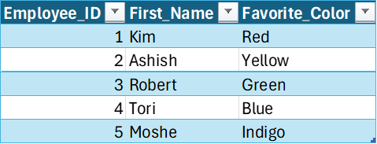
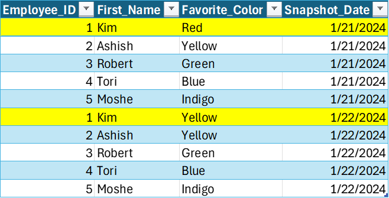
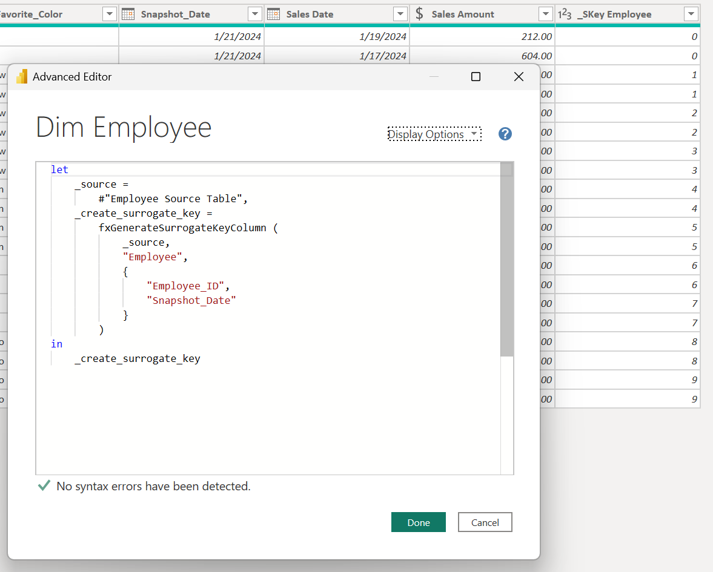

## Introduction

**Click [here](#overview-fxgeneratesurrogatekeycolumn) to go straight to the function.**

One of the key (pun intended) aspects of dimensional modeling is the creation of surrogate keys in your dimension tables. **A surrogate key is a column generated to serve as the primary key of the dimension in lieu of the natural key.**

There are many reasons why using surrogate keys is preferred over using natural keys in dimension tables. A few include:

1.   At times, the data you are importing does not have a natural key (I'm looking at you, spreadsheets).
2. If your dimension table is being populated from multiple sources, natural keys may conflict.
3. When creating slowly changing dimensions, the natural key will be repeated as the history of the record is preserved over time.

To address the issues above, you can create a new column to serve as a substitute (surrogate) primary key in place of the natural primary key of the table. The contents of the column should contain a unique value for each combination of what makes a record unique.

For example, let's say you want to create a slowly changing employee dimension table where the natural key is the employee id. The original table is shown below:



So far so good.

But look what happens when you start to snapshot the data:



We have captured the changed value for Kim's favorite color, but the Employee_ID is no longer unique and can't serve as the primary key.

**Insert surrogate key:**


The new _SKey_Employee column has one unique value for each combination of Employee_ID and Snapshot_Date. Now, when creating any fact table that needs to have a relationship with the employee dimension, you can bring the _SKey_Employee into the fact by joining on both the Employee_ID and Snapshot_Date.

The following custom M function helps you to create surrogate keys in a easy, consistent way.

## Overview: fxGenerateSurrogateKeyColumn

**❗IMPORTANT NOTE❗- In some data sources, if not specified, the sort order of the records returned can be different on each call. Because of the way Power Query handles [referenced tables](https://learn.microsoft.com/en-us/power-bi/guidance/power-query-referenced-queries), referencing a table where a surrogate key is generated with the method below can result in the integrity of the keys between tables to fail. If that is the case in your project, you can do one of the following:**
**1. Explicitly Define Sort Order** - Sort the table by the columns used to generate the surrogate key before calling the function.
**2. Cache Results (Option 1)** - When using dataflows in a Premium or PPU workspace, make the table you generate the surrogate key on a [computed table.](https://learn.microsoft.com/en-us/power-query/dataflows/computed-tables)
**3. Cache Results (Option 2)** - When using dataflows not in a Premium or PPU workspace, separate out the table you generate the surrogate key on and the tables that reference it in separate dataflows.

**Purpose:**

This function takes a table, a new SKey column name, and an optional list of columns to group by, and returns a new table with an added SKey column that assigns a unique index to each row or group of rows.

**Parameters:**

**tableToTransform**as table
The table on which to generate a new surrogate key column.

**newSKeyColumnName**as text
The new column name for the surrogate key. The input will be prefixed with "_SKey ".

*optional***columnsToGroupBy**as list
The list of columns used to generate the surrogate key. A unique key will be generated for each unique combination of values. If left blank, each row will be considered unique.

## Required Custom Functions

This function is dependent on these additional custom functions.  Copy them into your Power Query project for fxGenerateSurrogateKeyColumn function to work.

- [fxJoinAndExpandTable](https://daxnoob.blog/2024/01/14/custom-m-function-1-fxjoinandexpandtable/)

## Function without documentation

```powerquery
let
    fxFunction =
        (
            tableToTransform as table,
            newSKeyColumnName as text,
            optional columnsToGroupBy as list
        ) as table =>
            let
                _cleaned_skey_column = // Set new surrogate key column name.
                    "_SKey " & newSKeyColumnName,
                _create_table_group =
                    if
                        columnsToGroupBy is null
                    then // If null, a unique surrogate key is generated for each record in the table.
                        Table.AddIndexColumn (
                            tableToTransform,
                            _cleaned_skey_column,
                            0,
                            1,
                            Int64.Type
                        )
                    else // If not null, surrogate key is generated for each grouping of provided columns.
                        let
                            _create_distinct_table_group = // Create a table of distinct value combinations for the columns provided and then add index.
                                Table.AddIndexColumn (
                                    Table.Distinct (
                                        Table.SelectColumns (
                                            tableToTransform,
                                            columnsToGroupBy
                                        )
                                    ),
                                    _cleaned_skey_column,
                                    0,
                                    1,
                                    Int64.Type
                                ),
                            _join_and_expand_table = // Join generated surrogate key back to original table.
                                fxJoinAndExpandTable (
                                    1,
                                    tableToTransform,
                                    _create_distinct_table_group,
                                    columnsToGroupBy,
                                    { _cleaned_skey_column }
                                )
                        in
                            _join_and_expand_table
            in
                _create_table_group
in
    fxFunction
```

## Function with documentation

```powerquery
let
    fxFunction =
        (
            tableToTransform as table,
            newSKeyColumnName as text,
            optional columnsToGroupBy as list
        ) as table =>
            let
                _cleaned_skey_column = // Set new surrogate key column name.
                    "_SKey " & newSKeyColumnName,
                _create_table_group =
                    if
                        columnsToGroupBy is null
                    then // If null, a unique surrogate key is generated for each record in the table.
                        Table.AddIndexColumn (
                            tableToTransform,
                            _cleaned_skey_column,
                            0,
                            1,
                            Int64.Type
                        )
                    else // If not null, surrogate key is generated for each grouping of provided columns.
                        let
                            _create_distinct_table_group = // Create a table of distinct value combinations for the columns provided and then add index.
                                Table.AddIndexColumn (
                                    Table.Distinct (
                                        Table.SelectColumns (
                                            tableToTransform,
                                            columnsToGroupBy
                                        )
                                    ),
                                    _cleaned_skey_column,
                                    0,
                                    1,
                                    Int64.Type
                                ),
                            _join_and_expand_table = // Join generated surrogate key back to original table.
                                fxJoinAndExpandTable (
                                    1,
                                    tableToTransform,
                                    _create_distinct_table_group,
                                    columnsToGroupBy,
                                    { _cleaned_skey_column }
                                )
                        in
                            _join_and_expand_table
            in
                _create_table_group,
    fxDocumentation =
        type function (
            tableToTransform as (
                type table meta [
                    Documentation.FieldCaption = "Table to Transform",
                    Documentation.FieldDescription = "The table on which to generate a new surrogate key column."
                ]
            ),
            newSKeyColumnName as (
                type text meta [
                    Documentation.FieldCaption = "New SKey Column Name",
                    Documentation.FieldDescription = "The new column name for the surrogate key. The input will be prefixed with ""_SKey"".",
                    Documentation.SampleValues =
                        {
                            "Geo",
                            "Parcel",
                            "Ticket"
                        }
                ]
            ),
            optional columnsToGroupBy as (
                type list meta [
                    Documentation.FieldCaption = "Columns To Group By",
                    Documentation.FieldDescription = "The list of columns used to generate the surrogate key. A unique key will be generated for each unique combination of values. If left blank, each row will be considered unique.",
                    Documentation.SampleValues =
                        {
                            "null",
                            "{ ""AZ"", ""Metro"" }"
                        }
                ]
            )
        ) as table meta
            [
                Documentation.Name = "fxGenerateSurrogateKeyColumn",
                Documentation.Description = "This function takes a table, a new SKey column name, and an optional list of columns to group by, and returns a new table with an added SKey column that assigns a unique index to each row or group of rows.",
                Documentation.Category = "Generate",
                Documentation.Examples =
                    {
                        [
                            Description = "",
                            Code = "fxGenerateSurrogateKeyColumn ( dimParcel, ""Parcel"", {""Parcel Id""} )",
                            Result = "dimParcel table with new surrogate key column called ""_SKey Parcel""."
                        ]
                    }
            ],
    fxReplaceMeta =
        Value.ReplaceType (
            fxFunction,
            fxDocumentation
        )
in
    fxReplaceMeta
```

## Examples

**Example 1: Snapshotted employee table**

Snapshotted table without surrogate key:


Create surrogate key column:



Select dimension columns and remove duplicates:


## Conclusion

Hopefully this function will help you as much as it has helped me. If you have any comments or questions, please let me know. I welcome the feedback!
