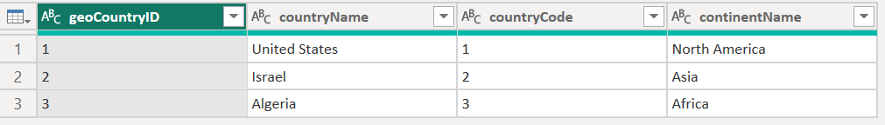
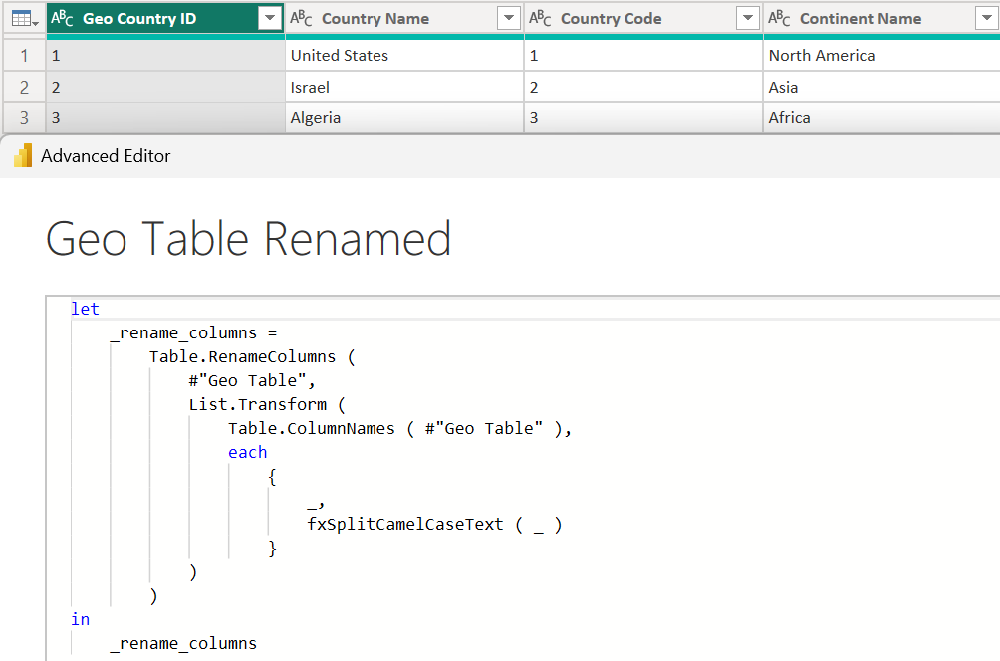

## Introduction

**Click [here](#overview-fxsplitcamelcasetext) to go straight to the function.**

When importing data from a database, column names are often stored in [camel or pascal case](https://www.freecodecamp.org/news/snake-case-vs-camel-case-vs-pascal-case-vs-kebab-case-whats-the-difference/) because of the challenges/inconveniences spaces can cause.

While it is best practice to avoid spaces in SQL column names, I prefer storing Power BI column names in proper case because they are often used directly in visuals. You do have the ability to give alternate display names in visuals, but I would rather not have to do that every single time.

The following function was primarily created to be used in another function that bulk transforms camel/pascal case column names by adding spaces between words, but it can be used for any situation that you need to split camel/pascal strings.

In a future post, I'll share that function as well.

## Overview: fxSplitCamelCaseText

**Purpose:**

This function splits a string stored in camel or pascal case into multiple words separated by spaces.

**Parameters:**

**textToTransform** as text
The text stored in camel or pascal case.

## Function without documentation

```powerquery
let
    fxFunction =
        (
            textToTransform as text
        ) as text =>
            let
                fxIsUpper =
                    ( char as text ) as logical =>
                        Text.Upper ( char ) = char,
                _reverse_text =
                    Text.Reverse ( textToTransform ),
                _list_of_characters =
                    Text.ToList ( _reverse_text ),
                _create_reversed_text =
                    List.Accumulate (
                        _list_of_characters,
                        [
                            is_upper_previous = true,
                            transformed_text = ""
                        ],
                        ( state, current ) =>
                            [
                                is_upper_previous =
                                    if
                                        current = " "
                                    then
                                        true
                                    else
                                        fxIsUpper ( current ),
                                transformed_text =
                                    if
                                        current = " "
                                    then
                                        state[transformed_text]
                                    else if
                                        Text.End ( state[transformed_text], 1 ) = " "
                                    then
                                        state[transformed_text] & current
                                    else if
                                        fxIsUpper ( current ) and
                                            not state[is_upper_previous]
                                    then
                                        state[transformed_text] & current & " "
                                    else if
                                        not fxIsUpper ( current ) and
                                            state[is_upper_previous]
                                    then
                                        state[transformed_text] & " " & current
                                    else
                                        state[transformed_text] & current
                            ]
                    )[transformed_text],
                _restore_text_order =
                    Text.Reverse ( _create_reversed_text ),
                _trim_text =
                    Text.Trim ( _restore_text_order ),
                _capitalize_first_word =
                    Text.Upper ( Text.Start ( _trim_text, 1 ) ) &
                        Text.End ( _trim_text, Text.Length ( _trim_text ) - 1 )
            in
                _capitalize_first_word
in
    fxFunction
```

## Function with documentation

```powerquery
let
    fxFunction =
        (
            textToTransform as text
        ) as text =>
            let
                fxIsUpper =
                    ( char as text ) as logical =>
                        Text.Upper ( char ) = char,
                _reverse_text =
                    Text.Reverse ( textToTransform ),
                _list_of_characters =
                    Text.ToList ( _reverse_text ),
                _create_reversed_text =
                    List.Accumulate (
                        _list_of_characters,
                        [
                            is_upper_previous = true,
                            transformed_text = ""
                        ],
                        ( state, current ) =>
                            [
                                is_upper_previous =
                                    if
                                        current = " "
                                    then
                                        true
                                    else
                                        fxIsUpper ( current ),
                                transformed_text =
                                    if
                                        current = " "
                                    then
                                        state[transformed_text]
                                    else if
                                        Text.End ( state[transformed_text], 1 ) = " "
                                    then
                                        state[transformed_text] & current
                                    else if
                                        fxIsUpper ( current ) and
                                            not state[is_upper_previous]
                                    then
                                        state[transformed_text] & current & " "
                                    else if
                                        not fxIsUpper ( current ) and
                                            state[is_upper_previous]
                                    then
                                        state[transformed_text] & " " & current
                                    else
                                        state[transformed_text] & current
                            ]
                    )[transformed_text],
                _restore_text_order =
                    Text.Reverse ( _create_reversed_text ),
                _trim_text =
                    Text.Trim ( _restore_text_order ),
                _capitalize_first_word =
                    Text.Upper ( Text.Start ( _trim_text, 1 ) ) &
                        Text.End ( _trim_text, Text.Length ( _trim_text ) - 1 )
            in
                _capitalize_first_word,
    fxDocumentation =
        type function (
            textToTransform as (
                type text meta [
                    Documentation.FieldCaption = "Text to Transform",
                    Documentation.FieldDescription = "The text stored in camel or pascal case.",
                    Documentation.SampleValues =
                        {
                            "helloWorld",
                            "ThisIsASampleText"
                        }
                ]
            )
        ) as text meta
            [
                Documentation.Name = "fxSplitCamelCaseText",
                Documentation.Description = "This function splits a string stored in camel or pascal case into multiple words separated by spaces.",
                Documentation.Category = "Clean",
                Documentation.Examples =
                    {
                        [
                            Description = "",
                            Code = "fxSplitCamelCaseText ( ""helloWorld"" )",
                            Result = "Hello World"
                        ],
                        [
                            Description = "",
                            Code = "fxSplitCamelCaseText ( ""ThisIsAnExampleString"" )",
                            Result = "This Is An Example String"
                        ]
                    }
            ],
    fxReplaceMeta =
        Value.ReplaceType (
            fxFunction,
            fxDocumentation
        )
in
    fxReplaceMeta
```

## Examples

**Example 1: Transforming a simple string**


**Example 2: Rename All Columns**

Starting table:



Renaming all columns at once leveraging the fxSplitCamelCaseText function:



## Conclusion

Hopefully this function will help you as much as it has helped me. If you have any comments or questions, please let me know. I welcome the feedback!
