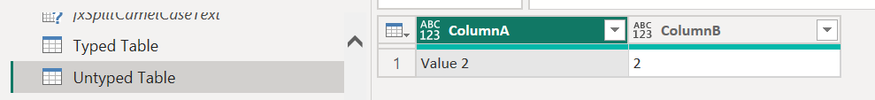

## Introduction

**Click [here](#overview-fxsetcolumntypesfrommodel) to go straight to the function.**

***Disclaimer*** this function is **not** the most exciting but is used in a few other more exciting functions I plan on sharing.

Sometimes when performing transformations in Power Query, data types are lost, e.g., when unioning two tables and columns with the same name have different data types.

This function was primarily created to help me restore lost column data types without having to explicitly list the types to restore, but it can be used in any situation you want to set the column types of a table based on the column types of another table.

## Overview: fxSetColumnTypesFromModel

**Purpose:**

This function replaces the column types of one table with the column types of another table with the same column names.

**Parameters:**

**tableToTransform** as table
The table on which you want to change the column types.

**modelTable** as table
The table containing the model column types.

## Function without documentation

```powerquery
let
    fxFunction =
        (
            tableToTransform as table,
            modelTable as table
        ) as table =>
            let
                _model_table_names = // Get column names of model table.
                    Table.ColumnNames ( modelTable ),
                _model_table_types_text = // Get names of column types of model table.
                    Table.Schema ( modelTable )[Kind],
                _get_model_table_types_from_text = // For each column type name, get column type.
                    List.Transform (
                        _model_table_types_text,
                        each
                            Record.Field (
                                [
                                    any = type any,
                                    binary = type binary,
                                    date = type date,
                                    datetime = type datetime,
                                    datetimezone = type datetimezone,
                                    duration = type duration,
                                    list = type list,
                                    logical = type logical,
                                    null = type any,
                                    number = type number,
                                    record = type record,
                                    table = type table,
                                    text = type text,
                                    time = type time
                                ],
                                _
                            )
                    ),
                _combine_names_and_types = // Create list of column names and types.
                    List.Zip (
                        {
                            _model_table_names,
                            _get_model_table_types_from_text
                        }
                    ),
                _change_types = // Apply each column name and type to tableToTransform
                    List.Accumulate (
                        _combine_names_and_types,
                        tableToTransform,
                        ( state, current ) =>
                            Table.TransformColumnTypes (
                                state,
                                {
                                    {
                                        current{0},
                                        current{1}
                                    }
                                }
                            )
                    )
            in
                _change_types
in
    fxFunction
```

## Function with documentation

```powerquery
let
    fxFunction =
        (
            tableToTransform as table,
            modelTable as table
        ) as table =>
            let
                _model_table_names = // Get column names of model table.
                    Table.ColumnNames ( modelTable ),
                _model_table_types_text = // Get names of column types of model table.
                    Table.Schema ( modelTable )[Kind],
                _get_model_table_types_from_text = // For each column type name, get column type.
                    List.Transform (
                        _model_table_types_text,
                        each
                            Record.Field (
                                [
                                    any = type any,
                                    binary = type binary,
                                    date = type date,
                                    datetime = type datetime,
                                    datetimezone = type datetimezone,
                                    duration = type duration,
                                    list = type list,
                                    logical = type logical,
                                    null = type any,
                                    number = type number,
                                    record = type record,
                                    table = type table,
                                    text = type text,
                                    time = type time
                                ],
                                _
                            )
                    ),
                _combine_names_and_types = // Create list of column names and types.
                    List.Zip (
                        {
                            _model_table_names,
                            _get_model_table_types_from_text
                        }
                    ),
                _change_types = // Apply each column name and type to tableToTransform
                    List.Accumulate (
                        _combine_names_and_types,
                        tableToTransform,
                        ( state, current ) =>
                            Table.TransformColumnTypes (
                                state,
                                {
                                    {
                                        current{0},
                                        current{1}
                                    }
                                }
                            )
                    )
            in
                _change_types,
    fxDocumentation =
        type function (
            tableToTransform as (
                type table meta [
                    Documentation.FieldCaption = "Table to Transform",
                    Documentation.FieldDescription = "The table on which you want to change the column types."
                ]
            ),
            modelTable as (
                type table meta [
                    Documentation.FieldCaption = "Model Table",
                    Documentation.FieldDescription = "The table containing the model column types."
                ]
            )
        ) as table meta
            [
                Documentation.Name = "fxSetColumnTypesFromModel",
                Documentation.Description = "This function replaces the column types of one table with the column types of another table with the same column names.",
                Documentation.Category = "Clean"
            ],
    fxReplaceMeta =
        Value.ReplaceType (
            fxFunction,
            fxDocumentation
        )
in
    fxReplaceMeta
```

## Examples

**Example:**

In this example, you want to union two tables together and keep the column types of the first table.

Table 1: Typed Table


Table 2: Untyped Table



The issue occurs when you union the tables together:


As you can see above, the data types of the first table have been lost. We can restore them using our fxSetColumnTypesFromModel function.


**As written, the function restores columns base type not the facet, but I'm sure you can modify the function to restore the facet as well.**

## Conclusion

Hopefully this function will help you as much as it has helped me. If you have any comments or questions, please let me know. I welcome the feedback!
