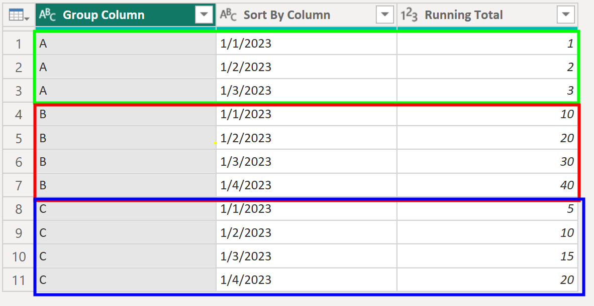
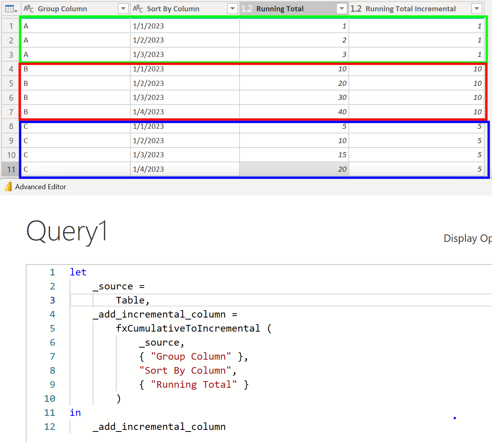
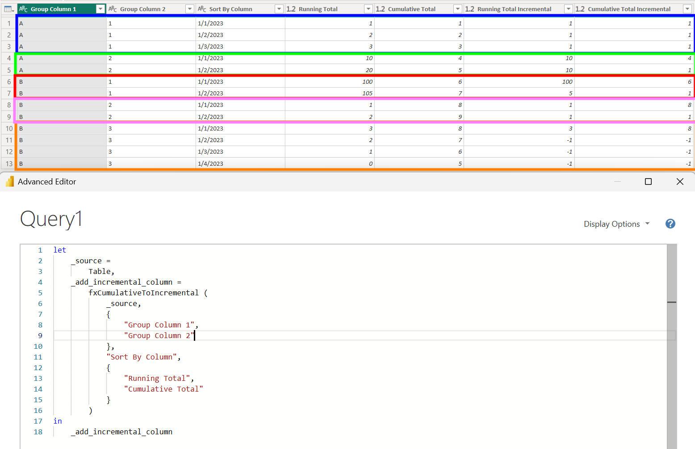

## Introduction

**Click [here](#overview-fxcumulativetoincremental) to go straight to the function.**

***Big thanks to Gil Raviv for his [cumulative to incremental article](https://datachant.com/2021/05/05/from-cumulative-numbers-to-increments/) for helping me get started creating this custom function.***

When working with data in Power BI, my preference is to work with fully additive facts.

Kimball briefly explains fact additivity here:

> The numeric measures in a fact table fall into three categories. The most flexible and useful facts are fully *additive*; additive measures can be summed across any of the dimensions associated with the fact table. *Semi-additive*measures can be summed across some dimensions, but not all; balance amounts are common semi-additive facts because they are additive across all dimensions except time. Finally, some measures are completely *non-additive*, such as ratios. A good approach for non-additive facts is, where possible, to store the fully additive components of the non-additive measure and sum these components into the final answer set before calculating the final non-additive fact. This final calculation is often done in the BI layer or OLAP cube.
>
>
> [Additive, Semi-Additive, and Non-Additive Facts | Kimball Group](https://www.kimballgroup.com/data-warehouse-business-intelligence-resources/kimball-techniques/dimensional-modeling-techniques/additive-semi-additive-non-additive-fact/)

A common semi-additive data source you might run into is one with a running total column. What makes this semi-additive is that you can sum up the column in all dimensions except for time.

I much prefer to transform the running total column into an incremental one and then use DAX to create a running total measure instead of working with the complexity of a semi-additive DAX calculation. It is more work up front but provides a more flexible and easier to work with semantic model.

The following function transforms one or more cumulative columns and transforms those columns into incremental ones.

## Overview: fxCumulativeToIncremental

**Purpose:**

This function transforms one or more running total columns into incremental columns

**Parameters:**

**tableToTransform** as table
The table containing the cumulative columns to be transformed.

**groupByColumns** as list
The columns that, when taken together, the running total is applied to.

**sortByColumn** as text
The time/sort by column for the running total.

**columnsToTransform** as list
The cumulative columns to be transformed to incremental.

## Required Custom Functions

This function is dependent on these additional custom functions. Copy them into your Power Query project for fxCumulativeToIncremental function to work.

- [fxSetColumnTypesFromModel](https://daxnoob.blog/custom-m-function-4-fxsetcolumntypesfromexample/)

## Function without documentation

```powerquery
let
    fxFunction =
        (
            tableToTransform as table,
            groupByColumns as list,
            sortByColumn as text,
            columnsToTransform as list
        ) as table =>
            let
                _create_groups = // Group all rows by group by columns
                    Table.Group (
                        tableToTransform,
                        groupByColumns,
                        {
                            {
                                "Group",
                                each
                                    _,
                                type
                                    table
                            }
                        }
                    ),
                _create_incremental_data = // For each set of grouped rows, create incremental column
                    Table.AddColumn (
                        _create_groups,
                        "Data",
                        each
                            let
                                _sort_by_date = // Sort data by sort by column
                                    Table.Sort (
                                        [Group],
                                        { { sortByColumn, Order.Ascending } }
                                    ),
                                _create_index = // Add index to be used for calculating difference between each cumulative row
                                    Table.AddIndexColumn (
                                        _sort_by_date,
                                        "Index",
                                        0,
                                        1,
                                        Int64.Type
                                    ),
                                _create_incremental_data_for_each_column = // For each cumulative column, create incremental column
                                    List.Accumulate(
                                        columnsToTransform,
                                        _create_index,
                                        (
                                            state,
                                            columnToTransform
                                        ) =>
                                            let
                                                _buffer_data = // Buffer results
                                                    List.Buffer (
                                                        Table.Column(state, columnToTransform)
                                                    ),
                                                _calculate_incremental_value = // Add column with calculated incremental value
                                                    Table.AddColumn (
                                                        state,
                                                        columnToTransform & " Incremental",
                                                        each
                                                            if
                                                                [Index] > 0
                                                            then
                                                                Record.Field(_, columnToTransform) -
                                                                    _buffer_data { [Index] - 1 }
                                                            else
                                                                Record.Field(_, columnToTransform),
                                                        type
                                                            number
                                                    )
                                                in
                                                    _calculate_incremental_value
                                    )
                            in
                                _create_incremental_data_for_each_column
                    ),
                _columns_to_extract = // Get list of columns to extract from group
                    List.Combine (
                        {
                            List.RemoveItems (
                                Table.ColumnNames ( tableToTransform ),
                                groupByColumns
                            ),
                            List.Transform (
                                columnsToTransform,
                                each
                                    _ & " Incremental"
                            )
                        }
                    ),
                _extract_incremental_data = // Expand columns from group
                    Table.ExpandTableColumn (
                        _create_incremental_data,
                        "Data",
                        _columns_to_extract,
                        _columns_to_extract
                    ),
                _remove_group_column = // Remove group column
                    Table.RemoveColumns (
                        _extract_incremental_data,
                        { "Group" }
                    ),
                _restore_column_types = // Set column types
                    fxSetColumnTypesFromModel (
                        _remove_group_column,
                        List.Accumulate(
                            columnsToTransform,
                            tableToTransform,
                            (
                                state,
                                column
                            ) =>
                                Table.AddColumn (
                                    state,
                                    column & " Incremental",
                                    each
                                        null,
                                    type
                                        number
                                )
                        )
                    )
            in
                _restore_column_types
in
    fxFunction
```

## Function with documentation

```powerquery
let
    fxFunction =
        (
            tableToTransform as table,
            groupByColumns as list,
            sortByColumn as text,
            columnsToTransform as list
        ) as table =>
            let
                _create_groups = // Group all rows by group by columns
                    Table.Group (
                        tableToTransform,
                        groupByColumns,
                        {
                            {
                                "Group",
                                each
                                    _,
                                type
                                    table
                            }
                        }
                    ),
                _create_incremental_data = // For each set of grouped rows, create incremental column
                    Table.AddColumn (
                        _create_groups,
                        "Data",
                        each
                            let
                                _sort_by_date = // Sort data by sort by column
                                    Table.Sort (
                                        [Group],
                                        { { sortByColumn, Order.Ascending } }
                                    ),
                                _create_index = // Add index to be used for calculating difference between each cumulative row
                                    Table.AddIndexColumn (
                                        _sort_by_date,
                                        "Index",
                                        0,
                                        1,
                                        Int64.Type
                                    ),
                                _create_incremental_data_for_each_column = // For each cumulative column, create incremental column
                                    List.Accumulate(
                                        columnsToTransform,
                                        _create_index,
                                        (
                                            state,
                                            columnToTransform
                                        ) =>
                                            let
                                                _buffer_data = // Buffer results
                                                    List.Buffer (
                                                        Table.Column(state, columnToTransform)
                                                    ),
                                                _calculate_incremental_value = // Add column with calculated incremental value
                                                    Table.AddColumn (
                                                        state,
                                                        columnToTransform & " Incremental",
                                                        each
                                                            if
                                                                [Index] > 0
                                                            then
                                                                Record.Field(_, columnToTransform) -
                                                                    _buffer_data { [Index] - 1 }
                                                            else
                                                                Record.Field(_, columnToTransform),
                                                        type
                                                            number
                                                    )
                                                in
                                                    _calculate_incremental_value
                                    )
                            in
                                _create_incremental_data_for_each_column
                    ),
                _columns_to_extract = // Get list of columns to extract from group
                    List.Combine (
                        {
                            List.RemoveItems (
                                Table.ColumnNames ( tableToTransform ),
                                groupByColumns
                            ),
                            List.Transform (
                                columnsToTransform,
                                each
                                    _ & " Incremental"
                            )
                        }
                    ),
                _extract_incremental_data = // Expand columns from group
                    Table.ExpandTableColumn (
                        _create_incremental_data,
                        "Data",
                        _columns_to_extract,
                        _columns_to_extract
                    ),
                _remove_group_column = // Remove group column
                    Table.RemoveColumns (
                        _extract_incremental_data,
                        { "Group" }
                    ),
                _restore_column_types = // Set column types
                    fxSetColumnTypesFromModel (
                        _remove_group_column,
                        List.Accumulate(
                            columnsToTransform,
                            tableToTransform,
                            (
                                state,
                                column
                            ) =>
                                Table.AddColumn (
                                    state,
                                    column & " Incremental",
                                    each
                                        null,
                                    type
                                        number
                                )
                        )
                    )
            in
                _restore_column_types,
    fxDocumentation =
        type function (
            tableToTransform as (
                type table meta [
                    Documentation.FieldCaption = "Table to Transform",
                    Documentation.FieldDescription = "The table containing the cumulative columns to be transformed."
                ]
            ),
            groupByColumns as (
                type list meta [
                    Documentation.FieldCaption = "Group By Columns",
                    Documentation.FieldDescription = "The columns that, when taken together, the running total is applied to."
                ]
            ),
            sortByColumn as (
                type text meta [
                    Documentation.FieldCaption = "Sort by Column",
                    Documentation.FieldDescription = "The time/sort by column for the running total."
                ]
            ),
            columnsToTransform as (
                type list meta [
                    Documentation.FieldCaption = "Columns to Transform",
                    Documentation.FieldDescription = "The cumulative columns to be transformed to incremental."
                ]
            )
        ) as table meta
            [
                Documentation.Name = "fxCumulativeToIncremental",
                Documentation.Description = "This function transforms one or more running total columns into incremental columns.",
                Documentation.Category = "Generate"
            ],
    fxReplaceMeta =
        Value.ReplaceType (
            fxFunction,
            fxDocumentation
        )
in
    fxReplaceMeta
```

## Examples

**Example: One cumulative column with one group by column.**

Let's say you start with the following table which columns a cumulative column called "Running Total" grouped by a column called "Group Column" and sorted by a column called "Sort by Column":



As you can see, the value of Running Total increases for each Group Column over time. What we want is a column that just gets us the change in value for Running total over time for each value in Group Column.

We can do just that using our new custom function:



**Example: Multiple cumulative columns with multiple group by columns.**

We can also use the function to transform multiple columns with multiple group by columns at once:



## Conclusion

Hopefully this function will help you as much as it has helped me. If you have any comments or questions, please let me know. I welcome the feedback!
