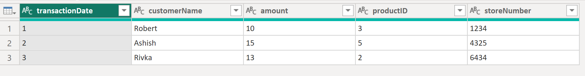

## Introduction

**Click [here](#overview-fxsplitcamelcasecolumns) to go straight to the function.**

In a previous post, [I shared a custom function called fxSplitCamelCaseText](https://daxnoob.blog/custom-m-function-3-fxsplitcamelcasetext/) that splits a string stored in camel or pascal case into multiple words separated by spaces.

That function was created primarily to be used in another function called fxSplitCamelCaseColumns that converts all camel/pascal case columns into proper case. In this post, I want to share that function with you.

## Overview: fxSplitCamelCaseColumns

**Purpose:**

This function splits all camel case column names in a table and converts them to proper case. The function also takes an optional list of alternative column name transformations.

**Parameters:**

**tableToTransform** as table
The table whose column names you want to transform.

*optional* **columnNameOverrides** as list
A list of column name overrides to be used instead of the default transformation.

## Required Custom Functions

This function is dependent on these additional custom functions. Copy them into your Power Query project for fxSplitCamelCaseColumns function to work.

- [fxSplitCamelCaseText](https://daxnoob.blog/custom-m-function-3-fxsplitcamelcasetext/)

## Function without documentation

```powerquery
let
    fxFunction =
        (
            tableToTransform as table,
            optional columnNameOverrides as nullable list
        ) as table =>
            let
                _source_column_names =
                    Table.ColumnNames ( tableToTransform ),
                _clean_column_name_overrides =
                    columnNameOverrides ?? {},
                _columns_to_override =
                    List.Transform (
                        _clean_column_name_overrides,
                        each _{ 0 }
                    ),
                _columns_to_transform =
                    List.RemoveItems (
                        _source_column_names,
                        _columns_to_override
                    ),
                _transform_source_column_names =
                    List.Transform (
                        _columns_to_transform,
                        each
                            {
                                _,
                                fxSplitCamelCaseText ( _ )
                            }
                    ),
                _combine_lists =
                    List.Combine (
                        {
                            _clean_column_name_overrides,
                            _transform_source_column_names
                        }
                    ),
                _apply_changes =
                    Table.RenameColumns (
                        tableToTransform,
                        _combine_lists
                    )
            in
                _apply_changes
in
    fxFunction
```

## Function with documentation

```powerquery
let
    fxFunction =
        (
            tableToTransform as table,
            optional columnNameOverrides as nullable list
        ) as table =>
            let
                _source_column_names =
                    Table.ColumnNames ( tableToTransform ),
                _clean_column_name_overrides =
                    columnNameOverrides ?? {},
                _columns_to_override =
                    List.Transform (
                        _clean_column_name_overrides,
                        each _{ 0 }
                    ),
                _columns_to_transform =
                    List.RemoveItems (
                        _source_column_names,
                        _columns_to_override
                    ),
                _transform_source_column_names =
                    List.Transform (
                        _columns_to_transform,
                        each
                            {
                                _,
                                fxSplitCamelCaseText ( _ )
                            }
                    ),
                _combine_lists =
                    List.Combine (
                        {
                            _clean_column_name_overrides,
                            _transform_source_column_names
                        }
                    ),
                _apply_changes =
                    Table.RenameColumns (
                        tableToTransform,
                        _combine_lists
                    )
            in
                _apply_changes,
    fxDocumentation =
        type function (
            tableToTransform as (
                type table meta [
                    Documentation.FieldCaption = "Table To Transform",
                    Documentation.FieldDescription = "The table whose column names you want to transform.",
                    Documentation.SampleValues =
                        {
                            "#table()"
                        }
                ]
            ),
            optional columnNameOverrides as (
                type nullable list meta [
                    Documentation.FieldCaption = "Column Name Overrides",
                    Documentation.FieldDescription = "A list of column name overrides to be used instead of the default transformation.",
                    Documentation.SampleValues =
                        {
                            "{ ""OldColumnName"", ""Override Column Name"", }"
                        }
                ]
            )
        ) as text meta
            [
                Documentation.Name = "fxSplitCamelCaseColumns",
                Documentation.Description = "This function splits all camel case column names in a table and converts them to proper case. The function also takes an optional list of alternative column name transformations.",
                Documentation.Category = "Clean"
            ],
    fxReplaceMeta =
        Value.ReplaceType (
            fxFunction,
            fxDocumentation
        )
in
    fxReplaceMeta
```

## Examples

**Example 1: Transformed columns without overrides**

Table with camel case column names:



Using the custom function to transform the column names:


**Example 2: Transformed columns with overrides**

Using the custom function to transform the column names and provider alternate transformations for two columns:


## Conclusion

Hopefully this function will help you as much as it has helped me. If you have any comments or questions, please let me know. I welcome the feedback!
