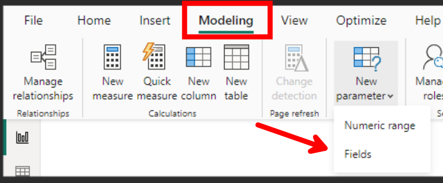
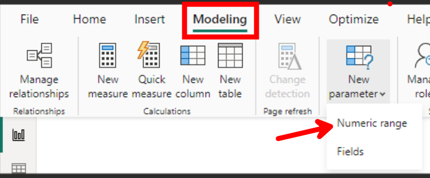

## Introduction

While learning about Power BI, you are likely to learn that designing a star schema consisting of fact and dimension tables is critical to building a good semantic model. You will also learn that it is best practice to create "Golden" models that can be used to support multiple reports instead of creating a new model for each one.

Star schemas are definitely important and are the foundation of a good data model, but there are other types of tables that can be added to enhance your model's analytical capabilities. One of those table types is what I like to call a "User Input" table.

## What are User Input tables?

User Input tables are tables that are used to capture the selection of the user and then use that selection to modify the results of a measure. Normally these selection options either do not exist in the star schema's fields or they do, but you want more control on how the selection filters the rest of the model.

For example, let's say you want to add a Yes/No slicer that allows the user to include or exclude a certain condition in a measure.

First, you can create the following table:

_Param Field Boolean = 
SELECTCOLUMNS (
    {
        ( "Yes" ),
        ( "No" )
    },
    "Parameter", [Value]
)

Then add the parameter field to a slicer and use the selection in your measure.

Example Measure =
VAR _user_selection =
    SELECTEDVALUE ( '_Param Field Boolean'[Parameter] )
VAR _apply_user_selection =
    FILTER (
        VALUES ( 'Dimension'[Source] ),
        _user_selection = "Yes"
            || 'Dimension'[Source] <> "Value To Exclude"
    )
VAR _result =
    CALCULATE (
        [Measure],
        _apply_user_selection
    )
RETURN
    _result

Table types that fall within User Input tables include, but are not limited to: field parameters, numeric ranges, some calculation groups, standalone date tables, etc.

Sometimes the User Input tables needed are very specific and the requirements are only known when the report requirements are known, but if you are creating models that will support multiple reports, and especially if other users will be doing the report building, I think it is helpful to pre-create generic ones.

By making generic User Input tables available in your model, you give the report builders more tools at their disposal and potentially avoid the need to edit the model or have the users create a composite model (which is the only way to add an additional User Input table without directly editing the main model).

## User Input Table Suggestions

Included below are some of the suggested User Input tables I recommend making available in your model. With all the tables below, I recommend hiding them from the report view so they will not clutter up the list of available tables for those who don't need them but will be available for advanced users who do.

**Name:** _CG Time Intelligence

**Description:** A calculation group containing calculation items for standard time intelligence modifiers, e.g., MTD, YTD, YOY, etc.

**Usage:** Report builders can leverage the time intelligence calculation items without having to create their own custom measures and can enable the report viewers to choose which modifier they want to apply to a visual.

**Special Considerations:** I like adding a calculated column on the table that includes a description of each of the calculation items. This helps the report builder know what the purpose of each item is.

---

**Name:** _Param Field xxx

**Description:** A field parameter table for the main conformed dimensions in your model, e.g., Date, Geography, etc.

**Usage:** Helpful when you need to allow the user to customize the fields included in the visual. For example, you might want to allow the user to look at certain metrics by different date grains such as Year, Quarter, Month, Day.

**Special Considerations:** You can create field parameters in the Modeling tab in the ribbon.



---

**Name:** Date Helper 1 and 2

**Description:** Two additional date tables with inactive relationships to the main date table in the model.

**Usage:** Helpful when you need the user to select a date without that selection automatically filtering the model. For example, you can have the user select a certain fiscal year from the date helper table and then display calculations for the next 10 fiscal years from the selection.

**Special Considerations:** The inactive relationships are not necessary but can be useful in some situations.


---

**Name:** _Param Field Boolean

**Description:** A pick list consisting of two values: Yes and No.

**Usage:** Helpful when you need a simple boolean input from the user.

**Special Considerations:** Can be created with the following calculated table.

```dax
_Param Field Boolean = 
SELECTCOLUMNS (
    {
        ( "Yes" ),
        ( "No" )
    },
    "Parameter", [Value]
)
```

---

**Name:** _Param Field Rating

**Description:** A pick list consisting of rating values: Low, Medium-Low, Medium, Medium-High, High.

**Usage:** Helpful when you want to allow the user to select a rating that can be applied to the calculation.

**Special Considerations:** Can be created with the following calculated table. Make sure to sort the Parameter column by the Parameter Order column.

```dax
_Param Field Rating = 
SELECTCOLUMNS (
    {
        ( "High", 4 ),
        ( "Medium-High", 3 ),
        ( "Medium", 2 ),
        ( "Medium-Low", 1 ),
        ( "Low", 0 )                
    },
    "Parameter", [Value1],
    "Parameter Order", [Value2]    
)
```

---

**Name:** _Param Field Stoplight

**Description:** A pick list consisting of rating values: Red, Yellow, Green.

**Usage:** Helpful when you want to allow the user to select a stoplight value that can be applied to the calculation. For example, if you have conditional formatting stoplight icons on a visual, you can allow the user to filter to a specific icon color.

**Special Considerations:** Can be created with the following calculated table. Make sure to sort the Parameter column by the Parameter Order column.

```dax
_Param Field Stoplight = 
SELECTCOLUMNS (
    {
        ( "Green", 1 ),
        ( "Yellow", 2 ),
        ( "Red", 3 )
    },
    "Parameter", [Value1],
    "Parameter Sort", [Value2]    
)
```

---

**Name:** _Param Numeric 1, _Param Numeric 10, _Param Numeric 100, etc.

**Description:** A picklist consisting of a numerical range incremented by a consistent value, e.g. 0 to 1 increasing by 0.01, 0 to 100 increasing by 1, etc.

**Usage:** Helpful when you want to allow the user to select a numerical value that can be applied to the calculation. For example, if you have a numeric range from 0 to 1 increasing by 0.01, you can allow the user to adjust a calculation by a certain percentage.

**Special Considerations:** You can create numeric parameters in the Modeling tab in the ribbon.



## Conclusion

Like always, if you have any questions or feedback, please reach out. I'd love to hear from you!
