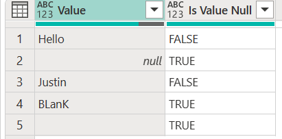

I have been spending a lot of time in Power Query lately, and one thing that I have been trying to do is to compile a custom M function library that I can use to speed up my development instead of writing the same transformations over and over again (see [What is DRY? Hint: It makes for great code](https://docs.getdbt.com/terms/dry)).

## The Situation

While I was transforming some data, I wanted to check if a value was null or "like null" i.e. blank, unknown, "", etc.

So, I wrote something like this:

```powerquery
let
    _table =
        #table (
            { "Value" },
            {
                { "Hello" },
                { null },
                { "Justin" },
                { "BLanK" },
                { "" }
            }
        ),
    _add_column =
        Table.AddColumn (
            _table,
            "Is Value Null",
            each
                List.Contains (
                    {
                        null,
                        "blank",
                        "empty",
                        "unknown",
                        "null",
                        ""
                    },
                    Text.Lower ( [Value ] )
                )
        )
in
    _add_column
```



This works if I only need to use this logic once, but what if I need to perform the same steps multiple times? And what happens when the list of "null" values changes?

## Enter Custom Function

If you find yourself writing the same transformations over and over again, like the example above, you might have yourself a perfect candidate for a [custom function](https://learn.microsoft.com/en-us/powerquery-m/m-spec-functions).

With a custom function, you can parameterize and save a set of transformations to be reused in other queries, saving you from having the rewrite the same code multiple times.

So instead of writing the "is like null" step multiple times, I wrote the following function:

```powerquery
let
    fxFunction =
        (
            optional valueToCheck as any
        ) as logical =>
            let
                _check_if_null =
                    if
                        valueToCheck is null
                    then
                        true
                    else
                        try
                            List.Contains (
                                {
                                    "blank",
                                    "empty",
                                    "unknown",
                                    "null",
                                    ""
                                },
                                Text.Lower ( valueToCheck )
                            )
                        otherwise
                            false
            in
                _check_if_null
in
    fxFunction
```

With some extra functionality that ensures we don't get an error if we test a non-text value, the logic of the two queries is the same, except that you now can pass a value into the "ValueToCheck" parameter, and a boolean value is returned.

Now that we have written the function, you can use it in the original query like so:

```powerquery
let
    _table =
        #table (
            { "Value" },
            {
                { "Hello" },
                { null },
                { "Justin" },
                { "BLanK" },
                { "" }
            }
        ),
    _add_column =
        Table.AddColumn (
            _table,
            "Is Value Null",
            each
                fxIsLikeNull ( [Value] )
        )
in
    _add_column
```

## Documentation...

I don't know about you, but I sometimes come back to code I have written and can't for the life of me remember why I did what I did. That being said, I have been trying to get into the habit of documenting my custom functions.

You can add in-line comments to your code and also add more robust documentation as described [here](https://learn.microsoft.com/en-us/power-query/handling-documentation). Another good resource to check out is [Alex Powers'](https://www.linkedin.com/in/alexmpowers/) training video on [Power BI Dev Camp](https://powerbidevcamp.powerappsportals.com/sessions/session22/).

```powerquery
let
    fxFunction =
        (
            optional valueToCheck as any
        ) as logical =>
            let
                _check_if_null =
                    if
                        valueToCheck is null
                    then
                        true
                    else
                        try //Text.Lower on non text value will error.
                            List.Contains (
                                {
                                    "blank",
                                    "empty",
                                    "unknown",
                                    "null",
                                    ""
                                },
                                Text.Lower ( valueToCheck )
                            )
                        otherwise
                            false
            in
                _check_if_null,
    fxDocumentation =
        type function (
            optional valueToCheck as (
                type any meta [
                    Documentation.FieldCaption = "Value To Check",
                   Documentation.FieldDescription = "The value to check if null.",
                    Documentation.SampleValues =
                        {
                            "1",
                            "null",
                            """blank""",
                            "test"
                        }
                ]
            )
        ) as logical meta
            [
                Documentation.Name = "fxIsLikeNull",
                Documentation.Description = "Checks if a value is null or like null.",
                Documentation.Category = "Clean",
                Documentation.Examples =
                    {
                        [
                            Description = "",
                            Code = "fxIsLikeNull ( null )",
                            Result = "true"
                        ],
                        [
                            Description = "",
                            Code = " fxIsLikeNull ( ""blank"" )",
                            Result = "true"
                        ],
                        [
                            Description = "",
                            Code = "fxIsLikeNull ( 1 )",
                            Result = "false"
                        ]
                    }
            ],
    fxReplaceMeta =
        Value.ReplaceType (
            fxFunction,
            fxDocumentation
        )
in
    fxReplaceMeta
```

## Function Library Coming Soon

I plan on posting some of the custom functions I've created that have been useful to me in my day-to-day work. Hopefully they will be useful to you as well, even if they need a little tweaking.

Feel free to ask any questions you have about the functions, and if you notice how they can be improved, I welcome the feedback!
