## Introduction

In my new role in Azure Data, I have spent a lot of time optimizing the performance of semantic models and DAX measures. One of the types of calculations we frequently use is 28-day (or 7-day) rolling distinct counts in order to see how our business is growing over time. In this post, I want to go over some of the DAX optimization techniques that we implemented to improve the speed of our calculations.

**Note - these optimizations worked on the model I was working with and won't necessarily work on all. Depending on your model and data layout, it could make performance worse. As always, test the patterns on your model before putting them into production. 🙂**

## The Model

The model is a simple star schema with a fact table (250+ million rows), date table, and one additional large dimension.

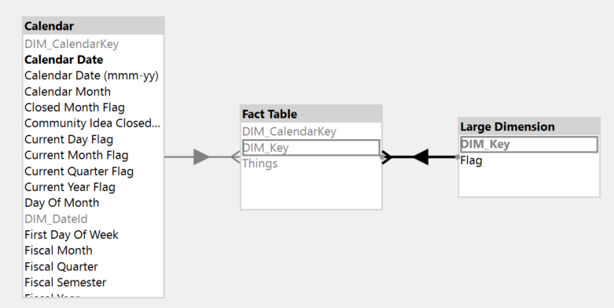

## The Initial Measure

The first pattern we had was a simple 28-day rolling distinct count on the column "Things" using DATESINPERIOD. We wanted to display the trend of this calculation over the past 6 months with a filter applied to the 'Large Dimension' table.

```dax
DEFINE
    MEASURE 'Fact Table'[0 - Inital Measure] =
        VAR _MaxDate =
            CALCULATE (
                MAX ( 'Fact Table'[DIM_CalendarKey] ),
                ALLEXCEPT ( 'Fact Table', Calendar )
            )
        VAR _Result =
            CALCULATE (
                DISTINCTCOUNT ( 'Fact Table'[Things] ),
                DATESINPERIOD ( Calendar[DIM_CalendarKey], _MaxDate, -28, DAY )
            )
        RETURN
            _Result
    VAR __DateFilter =
        FILTER (
            VALUES ( 'Calendar'[Calendar Date] ),
            AND (
                'Calendar'[Calendar Date] >= DATE ( 2024, 6, 1 ),
                'Calendar'[Calendar Date] < DATE ( 2024, 12, 30 )
            )
        )
    VAR __LargeDimFilter =
        TREATAS ( { "False" }, 'Large Dimension'[Flag] )
    VAR __Result =
        SUMMARIZECOLUMNS (
            'Calendar'[DIM_CalendarKey],
            __DateFilter,
            __LargeDimFilter,
            "Measure", [0 - Inital Measure]
        )

EVALUATE
__Result
```

The query is quite slow, taking a staggering 508 seconds to complete. Taking a look at the server timings, there are a total of 216 storage engine queries, mostly representing one query for each day's 28-day distinct count over the past 6 months.


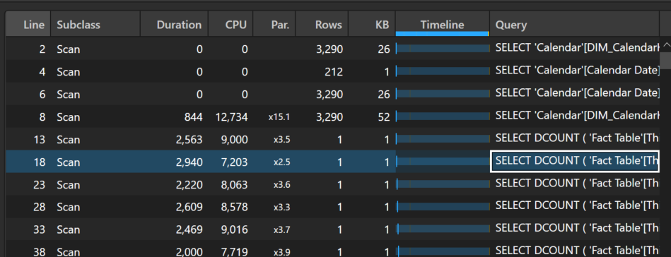

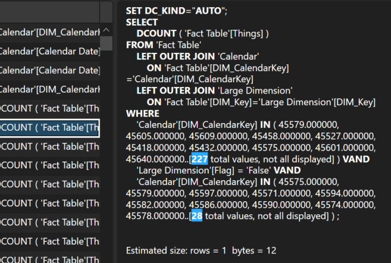

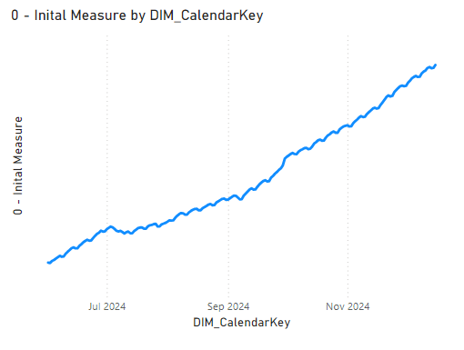

## Optimization 1: Moving the Query Execution to the Formula Engine

**Note, the pattern described below (moving the bulk of the query execution to the formula engine for distinct count measures) is not a one size fits all solution. Depending on your data layout and calculations, this can make your query execution time worse. As always, you need to test your model and measures to see which pattern will work best in your situation.**

For the first optimization, we experimented with forcing the DAX engine to leverage more of the formula engine to perform the rolling distinct count calculation as described in SQLBI's article: [Analyzing the performance of DISTINCTCOUNT in DAX - SQLBI](https://www.sqlbi.com/articles/analyzing-distinctcount-performance-in-dax/). Instead of having a separate storage engine event for each day, we can materialize the combinations of Things and days and then let the formula engine calculate the rolling distinct counts.

```dax
DEFINE
    MEASURE 'Fact Table'[1 - Basic Formula Engine] =
        VAR _MaxDate =
            CALCULATE (
                MAX ( 'Fact Table'[DIM_CalendarKey] ),
                ALLEXCEPT ( 'Fact Table', 'Calendar' )
            )
        VAR _Result =
            CALCULATE (
                SUMX ( DISTINCT ( 'Fact Table'[Things] ), 1 ),
                DATESINPERIOD ( 'Calendar'[DIM_CalendarKey], _MaxDate, -28, DAY )
            )
        RETURN
            _Result
    VAR __DateFilter =
        FILTER (
            VALUES ( 'Calendar'[Calendar Date] ),
            AND (
                'Calendar'[Calendar Date] >= DATE ( 2024, 6, 1 ),
                'Calendar'[Calendar Date] < DATE ( 2024, 12, 30 )
            )
        )
    VAR __LargeDimFilter =
        TREATAS ( { "False" }, 'Large Dimension'[Flag] )
    VAR __Result =
        SUMMARIZECOLUMNS (
            'Calendar'[DIM_CalendarKey],
            __DateFilter,
            __LargeDimFilter,
            "Measure", [1 - Basic Formula Engine]
        )

EVALUATE
__Result
```

By changing this one line, we see a significant improvement in performance. The total duration went from 508 seconds to just 49 seconds.  As you can see below, the majority of the processing is performed by the formula engine and there is now a large materialization of combinations of Things and days in one storage engine query.

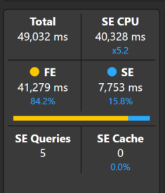

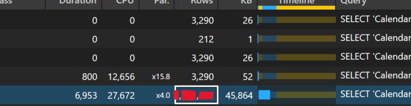

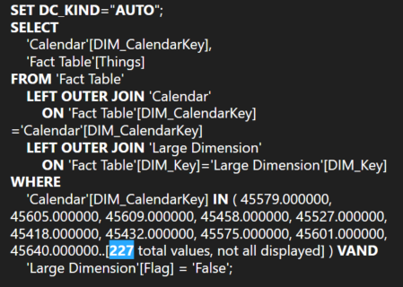

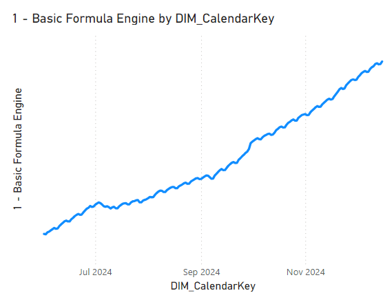

As noted above, this pattern is not a guaranteed performance improvement. The main factor in the gains we see here is the filter applied to the 'Large Dimension' table. When the filter is removed, the small storage engine events in the first pattern execute much quicker and the performance difference between the patterns is negligible. Nevertheless, we discovered that the pattern is indeed useful in our scenario. 🙂

## Optimization 2: Removing Daily Numbers for Previous Months

One of the reasons for the slowness of the measure is the number of days that the distinct count had to be evaluated for (around 180 = 6 months x 30 days). After some conversation with the report writers, it was determined that the daily numbers were only needed for the current month and the end of month numbers for previous months were sufficient to see the past trend. With this updated requirement, the greatest number of days that the calculation would need to be evaluated for is around 35 (30 days for the current month + 5 days for the last day of each previous month). Normally, the fewer data points that need to be calculated, the faster the measure will be.

```dax
DEFINE
    MEASURE 'Fact Table'[2 - End of Month Standard] =
        VAR _MaxDate =
            MAX ( Calendar[DIM_CalendarKey] )
        VAR _MaxDateAllSelected =
            CALCULATE (
                MAX ( 'Fact Table'[DIM_CalendarKey] ),
                ALLEXCEPT ( 'Fact Table', Calendar ),
                ALLSELECTED ( Calendar )
            )
        VAR _AllValidDates =
            FILTER (
                ALLSELECTED ( Calendar[DIM_CalendarKey] ),
                Calendar[DIM_CalendarKey] <= _MaxDateAllSelected
                    && (
                        Calendar[DIM_CalendarKey] > EOMONTH ( _MaxDateAllSelected, -1 )
                            || Calendar[DIM_CalendarKey] = EOMONTH ( Calendar[DIM_CalendarKey], 0 )
                    )
            )
        VAR _Result =
            IF (
                _MaxDate IN _AllValidDates,
                CALCULATE (
                    SUMX ( DISTINCT ( 'Fact Table'[Things] ), 1 ),
                    DATESINPERIOD ( Calendar[DIM_CalendarKey], _MaxDate, -28, DAY ),
                    REMOVEFILTERS ( Calendar )
                )
            )
        RETURN
            _Result
    VAR __DateFilter =
        FILTER (
            VALUES ( 'Calendar'[Calendar Date] ),
            AND (
                'Calendar'[Calendar Date] >= DATE ( 2024, 6, 1 ),
                'Calendar'[Calendar Date] < DATE ( 2024, 12, 30 )
            )
        )
    VAR __LargeDimFilter =
        TREATAS ( { "False" }, 'Large Dimension'[Flag] )
    VAR __Result =
        SUMMARIZECOLUMNS (
            'Calendar'[DIM_CalendarKey],
            __DateFilter,
            __LargeDimFilter,
            "Measure", [2 - End of Month Standard]
        )

EVALUATE
__Result
```

The measure above first calculates the starting date by only taking into account date filters set outside of the visual. Once we have the starting date, we can get a table of ALLSELECTED days that are in the current month or are at the end of a previous month. With this table of valid dates, we only return the distinct count where the current date is in the list of valid dates.

While a little more complex, we see another substantial performance improvement. The total duration is now around 12 seconds, and we are still able to see the trend over time.


## Optimization 3: Calendar Window Table

The final optimization takes the idea above one step forward and leverages a table that contains precomputed 28-day windows associated each date. For example, here is a sample of the table:

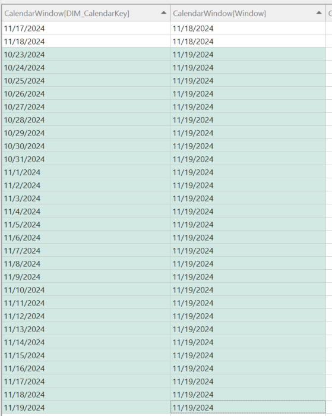

For the calendar window 11/19/2024, there are 28 associated calendar dates, starting on 11/19/2024 and going back 28 days (10/23/2024).

I have also added some additional columns: WindowDaySize and WindowDayShift. The WindowDaySize allows you to have more than one window size to slice your data by, e.g. 28-days, 7-days, etc. The WindowDayShift allows you to perform easier time intelligence with the CalendarWindow table. For example, if I want to get the rolling 28-day window for last year, I can filter the CalendarWindow table where WindowDaySize = 28 and WindowDayShift = -365 as shown below:

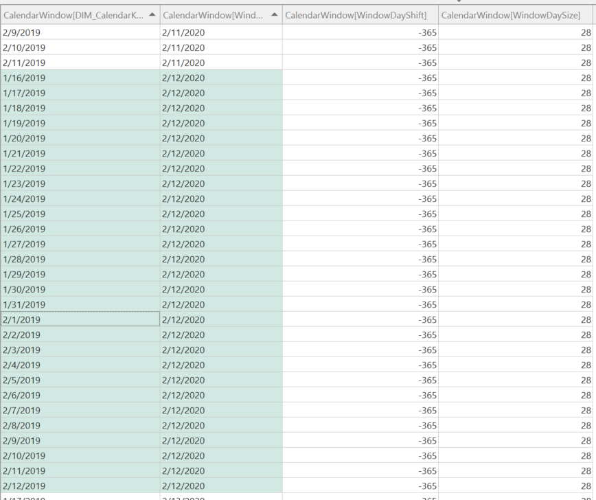

Here is a small notebook that allows you to create a customized CalendarWindow table from your main date table in your Fabric Lakehouse:

```python
sqlContext.read.format("delta").load("Tables/DIM_Calendar/").createOrReplaceTempView("vwDimCalendar")

def create_base_view(window_size):
    query_string = f'''
        CREATE OR REPLACE TEMPORARY VIEW vw{window_size}DayWindowBase AS
        SELECT
            CalendarDate AS DIM_CalendarKey,
            DATE_ADD(CalendarDate, Number) AS Window
        FROM
            vwDimCalendar
        CROSS JOIN
            ( SELECT EXPLODE(SEQUENCE(0,{window_size-1})) AS Number )
    '''

    spark.sql(query_string)

def create_window_view(window_size, window_shift_size, view_name):
    query_string = f'''
        CREATE OR REPLACE TEMPORARY VIEW {view_name} AS
        SELECT
            DATEADD(day, {window_shift_size}, DIM_CalendarKey) AS DIM_CalendarKey
            ,Window
            ,{window_size} AS WindowDaySize
            ,{window_shift_size} AS WindowDayShift
        FROM
            vw{window_size}DayWindowBase
    '''

    spark.sql(query_string)

window_sizes = [
    28,
    7
]

window_shift_sizes = [
    0,
    -7,
    -28,
    -365
]

final_query_parts = []

for window_size in window_sizes:
    create_base_view(window_size)

    for window_shift_size in window_shift_sizes:
        view_suffix = f'{window_shift_size}'.replace('-', 'Minus')
        view_name = f'vw{window_size}DayWindowShift{view_suffix}'
        create_window_view(window_size, window_shift_size, view_name)
        final_query_parts.append(f'SELECT * FROM {view_name}')

final_query_string = 'CREATE OR REPLACE TEMPORARY VIEW vwBRIDGE_CalendarWindow AS ' + ' UNION ALL '.join(final_query_parts)

spark.sql(final_query_string)

df = spark.sql("SELECT * FROM vwBRIDGE_CalendarWindow")
df.write.mode("overwrite").format("delta") \
    .option("overwriteSchema", "true") \
    .option("parquet.vorder.enabled ","true") \
    .save(f"Tables/BRIDGE_CalendarWindow")
```

After the CalendarWindow table has been created, create a many-to-many relationship between the new table and your fact table:

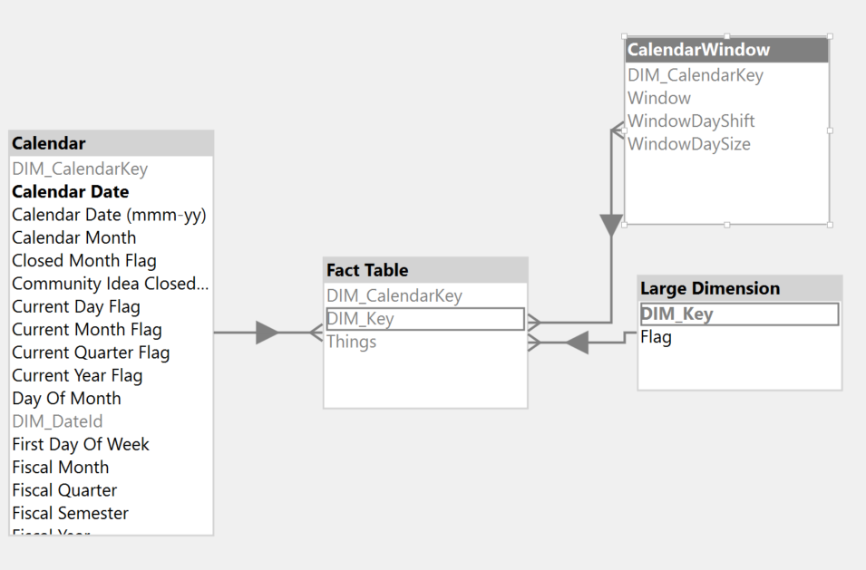

With the new table now in the model, we can use a similar pattern as before, now leveraging the precomputed windows.

```dax
DEFINE
    MEASURE 'Fact Table'[3 - Calendar Window] =
        VAR _MaxDateAllSelected =
            CALCULATE (
                MAX ( 'Fact Table'[DIM_CalendarKey] ),
                ALLEXCEPT ( 'Fact Table', Calendar ),
                ALLSELECTED ( Calendar ),
                REMOVEFILTERS ( CalendarWindow )
            )
        VAR _MinDateAllSelected =
            CALCULATE (
                MIN ( Calendar[Calendar Date] ),
                ALLSELECTED ( Calendar ),
                REMOVEFILTERS ( CalendarWindow )
            )
        VAR _AllValidWindows =
            FILTER (
                ALLSELECTED ( CalendarWindow[Window] ),
                CalendarWindow[Window] <= _MaxDateAllSelected
                    && CalendarWindow[Window] >= _MinDateAllSelected
                    && (
                        CalendarWindow[Window] > EOMONTH ( _MaxDateAllSelected, -1 )
                            || CalendarWindow[Window] = EOMONTH ( CalendarWindow[Window], 0 )
                    )
            )
        VAR _Result =
            CALCULATE (
                SUMX ( DISTINCT ( 'Fact Table'[Things] ), 1 ),
                CalendarWindow[WindowDayShift] = 0,
                CalendarWindow[WindowDaySize] = 28,
                KEEPFILTERS ( CalendarWindow[Window] IN _AllValidWindows ),
                REMOVEFILTERS ( Calendar )
            )
        RETURN
            _Result
    VAR __DateFilter =
        FILTER (
            VALUES ( 'Calendar'[Calendar Date] ),
            AND (
                'Calendar'[Calendar Date] >= DATE ( 2024, 6, 1 ),
                'Calendar'[Calendar Date] < DATE ( 2024, 12, 30 )
            )
        )
    VAR __LargeDimFilter =
        TREATAS ( { "False" }, 'Large Dimension'[Flag] )
    VAR __Result =
        SUMMARIZECOLUMNS (
            CalendarWindow[Window],
            __DateFilter,
            __LargeDimFilter,
            "Measure", [3 - Calendar Window]
        )

EVALUATE
__Result
```

Similarly to the second optimization, the measure above computes valid windows based on the ALLSELECTED dates and then uses the windows in the distinct count calculation. You can also see that I have filtered WindowDayShift and WindowDaySize to the correct values for this particular calculation. If I wanted to change the window size or shift it for time intelligence purposes, I can simply update the filters.

Again, we see a great performance gain with the total duration around 2 seconds. With the introduction of the new many-to-many relationship and precomputed windows, the normal left 0uter join pattern is replaced with a semi-join batch pattern that, in this scenario, reduces the combination of Things and dates materialized which speeds up the calculation.


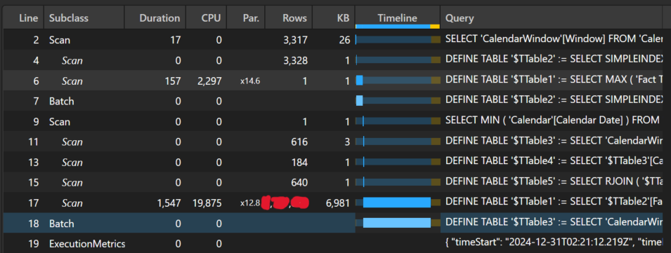

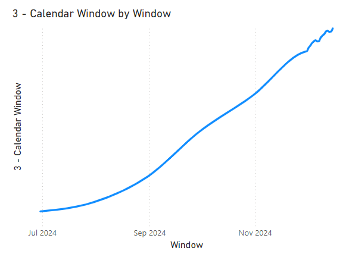

Here is the main batch xmSQL generated:

```
DEFINE TABLE '$TTable3' :=
SELECT
    'CalendarWindow'[DIM_CalendarKey],
    'CalendarWindow'[Window]
FROM 'CalendarWindow'
WHERE
    'CalendarWindow'[Window] IN ( 45630.000000, 45535.000000, 45504.000000, 45626.000000, 45639.000000, 45565.000000, 45635.000000, 45640.000000, 45631.000000, 45636.000000..[22 total values, not all displayed] ) VAND
    'CalendarWindow'[WindowDayShift] IN ( null, 0 ) VAND
    'CalendarWindow'[WindowDaySize] = 28,

DEFINE TABLE '$TTable4' :=
SELECT
    '$TTable3'[CalendarWindow$DIM_CalendarKey]
FROM '$TTable3',

DEFINE TABLE '$TTable5' :=
SELECT
    RJOIN ( '$TTable4'[CalendarWindow$DIM_CalendarKey] )
FROM '$TTable4'
    REVERSE BITMAP JOIN 'Fact Table' ON '$TTable4'[CalendarWindow$DIM_CalendarKey]='Fact Table'[DIM_CalendarKey],

CREATE SHALLOW RELATION '$TRelation1'
    MANYTOMANY
    FROM 'Fact Table'[DIM_CalendarKey]
        TO '$TTable3'[CalendarWindow$DIM_CalendarKey],

DEFINE TABLE '$TTable1' :=
SELECT
    '$TTable2'[Fact Table$Things],
    '$TTable3'[CalendarWindow$Window]
FROM '$TTable2'
    INNER JOIN '$TTable3'
        ON '$TTable2'[Fact Table$DIM_CalendarKey]='$TTable3'[CalendarWindow$DIM_CalendarKey]
REDUCED BY
'$TTable2' :=
SELECT
    'Fact Table'[Things],
    'Fact Table'[DIM_CalendarKey]
FROM 'Fact Table'
    LEFT OUTER JOIN 'Large Dimension'
        ON 'Fact Table'[DIM_Key]='Large Dimension'[DIM_Key]
WHERE
    'Large Dimension'[Flag] = 'False' VAND
    'Fact Table'[DIM_CalendarKey] ININDEX '$TTable5'[$SemijoinProjection];
```

Finally, I ended up combining the second and third optimizations into one measure so that it will still return valid results regardless if the report writer uses a column from the Calendar table or the CalendarWindow table.

```dax
DEFINE
    MEASURE 'Fact Table'[4 - Final] =
        VAR _IsCalendarWindowInScope =
            ISINSCOPE ( CalendarWindow[Window] )
        VAR _MaxDate =
            MAX ( Calendar[DIM_CalendarKey] )
        VAR _MaxDateAllSelected =
            CALCULATE (
                MAX ( 'Fact Table'[DIM_CalendarKey] ),
                ALLEXCEPT ( 'Fact Table', Calendar ),
                ALLSELECTED ( Calendar ),
                REMOVEFILTERS ( CalendarWindow )
            )
        VAR _MinDateAllSelected =
            CALCULATE (
                MIN ( Calendar[Calendar Date] ),
                ALLSELECTED ( Calendar ),
                REMOVEFILTERS ( CalendarWindow )
            )
        VAR _AllValidWindows =
            FILTER (
                ALLSELECTED ( CalendarWindow[Window] ),
                CalendarWindow[Window] <= _MaxDateAllSelected
                    && CalendarWindow[Window] >= _MinDateAllSelected
                    && (
                        CalendarWindow[Window] > EOMONTH ( _MaxDateAllSelected, -1 )
                            || CalendarWindow[Window] = EOMONTH ( CalendarWindow[Window], 0 )
                    )
            )
        VAR _AllValidDates =
            FILTER (
                ALLSELECTED ( Calendar[DIM_CalendarKey] ),
                Calendar[DIM_CalendarKey] <= _MaxDateAllSelected
                    && (
                        Calendar[DIM_CalendarKey] > EOMONTH ( _MaxDateAllSelected, -1 )
                            || Calendar[DIM_CalendarKey] = EOMONTH ( Calendar[DIM_CalendarKey], 0 )
                    )
            )
        VAR _CalendarWindowCalc =
            CALCULATE (
                SUMX ( DISTINCT ( 'Fact Table'[Things] ), 1 ),
                CalendarWindow[WindowDayShift] = 0,
                CalendarWindow[WindowDaySize] = 28,
                KEEPFILTERS ( CalendarWindow[Window] IN _AllValidWindows ),
                REMOVEFILTERS ( Calendar )
            )
        VAR _DefaultCalc =
            IF (
                _MaxDate IN _AllValidDates,
                CALCULATE (
                    SUMX ( DISTINCT ( 'Fact Table'[Things] ), 1 ),
                    DATESINPERIOD ( Calendar[DIM_CalendarKey], _MaxDate, -28, DAY ),
                    REMOVEFILTERS ( Calendar )
                )
            )
        VAR _Result =
            IF ( _IsCalendarWindowInScope, _CalendarWindowCalc, _DefaultCalc )
        RETURN
            _Result
    VAR __DateFilter =
        FILTER (
            VALUES ( 'Calendar'[Calendar Date] ),
            AND (
                'Calendar'[Calendar Date] >= DATE ( 2024, 6, 1 ),
                'Calendar'[Calendar Date] < DATE ( 2024, 12, 30 )
            )
        )
    VAR __LargeDimFilter =
        TREATAS ( { "False" }, 'Large Dimension'[Flag] )
    VAR __Result =
        SUMMARIZECOLUMNS (
            'Calendar'[DIM_CalendarKey],
            __DateFilter,
            __LargeDimFilter,
            "Measure", [4 - Final]
        )

EVALUATE
__Result
```

## Conclusion

Like always, if you have any questions or feedback, please reach out. I'd love to hear from you!
