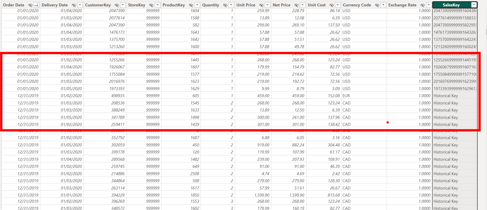
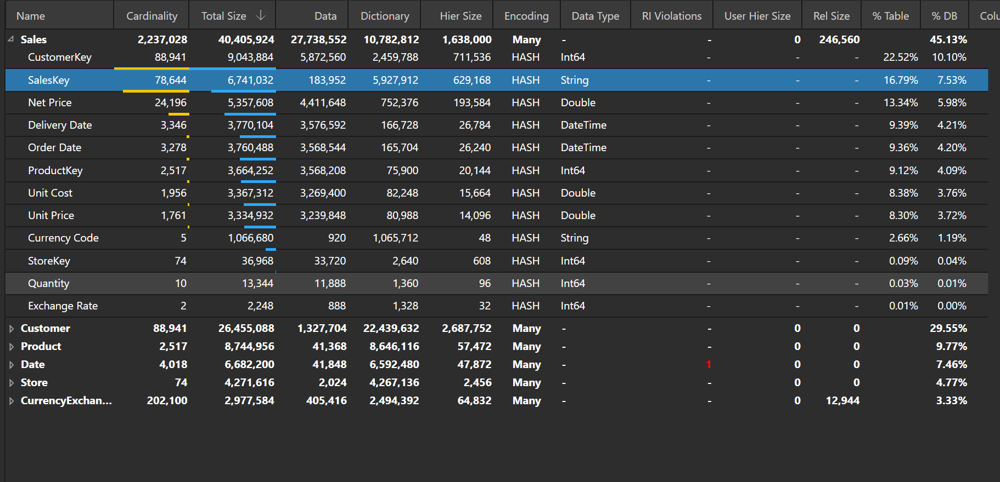
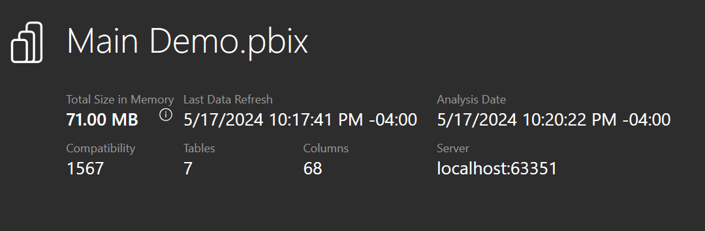

## Introduction

When working with larger semantic models, one of the things you are constantly trying to do is to reduce the model size while still meeting stakeholder requirements. Smaller models often result in faster queries, and you need to keep models under a certain size to stay within capacity memory limits.

One common problem child when it comes to model size is key columns. It is not uncommon to see a single key column take up over 50% of the total model size. Some keys are critical and can't be removed, e.g., keys between the fact and dimension tables, but others, e.g., primary/natural keys for the fact table, are a different story. If possible, it is highly recommended to not bring these columns in the model at all because of the high cost compared to the analytical benefit you get from storing them.

Another common problem child is bringing in more historical records than is necessary. While the data warehouse might have 50 years of data available, will 95% of the reports need data from that long ago? Again, if possible, it is best to only put in years of data that will satisfy the majority of the reports.

Despite these best practices, it is not uncommon to hear from stakeholders, "it is business critical to have all the details for every year that we have." The design dance begins.

In this post, I want to share about a modeling challenge I ran into that required digging deeper into the business requirements and some creative modeling techniques that resulted in huge memory savings.

## The Challenge

(Some of the details of the described situation have been modified for teaching purposes).

While working with one stakeholder, they insisted that they needed to have all years of data and they also needed to have the key of the fact table included for research purposes.

Unfortunately, including the key posed a bit of a challenge. That one column represented over 53% of the model with a total model size of 168.42 MB.

(I am using a sample model as an example; our real model was much larger).

Our model was approaching the capacity limits and refreshing it would be a challenge.

## The Solution

We talked through several different options:

- Increasing the capacity size (Costs $)
- Use Direct Query (Slower performance)
- Reduce the number of years imported (Not acceptable to business)
- Remove the sales key column (Not acceptable to business)
- Etc.

After more discussion, we discovered the business only needed the last years' worth of sales keys to be able to perform their research but still needed all the history for the rest of the fields.

With this information, our proposed solution was to replace the SalesKey column values with a default value for all records not in the latest year.

As you can see below, all keys for years before 2020 have been replaced with "Historical Key."

By drastically reducing the cardinality of the SalesKey column, the column takes up much less memory (from 94.94 MB to 6.74 MB), and the model size has been drastically reduced (from 168.42 MB to 85.39 MB).

## The Solution Expanded

We can potentially take this idea further and reduce the model size even more.

Let's assume that after further discussion, you discover that you only need customer address information for the current month and that you only need customer information for the last year, but you still need all historical sales.

Here are the current statistics for the Customer table:

To replace the address information for old customers, we can get the list of customer keys that only have sales before 2020-03-01 (the current month in the dataset). Then we can replace all the address information for those keys with a default value.

Again, reducing the cardinality of the high cardinality column reduces the total model size (from 85.39 MB to 80.88 MB):

Finally, we can create a new "Historical Customer" record and remap all Sales before 2020 to that new record. Then we can also remove customer records from the Customer table for CustomerKeys that don't have sales within the past year. Once we do that, here are the new model statistics:

## Conclusion

By taking the time to understand the true business requirements and coming up with some creative solutions, we were able to decrease the memory of the model by 58%.

Like always, if you have any questions or feedback, please reach out. I'd love to hear from you!
