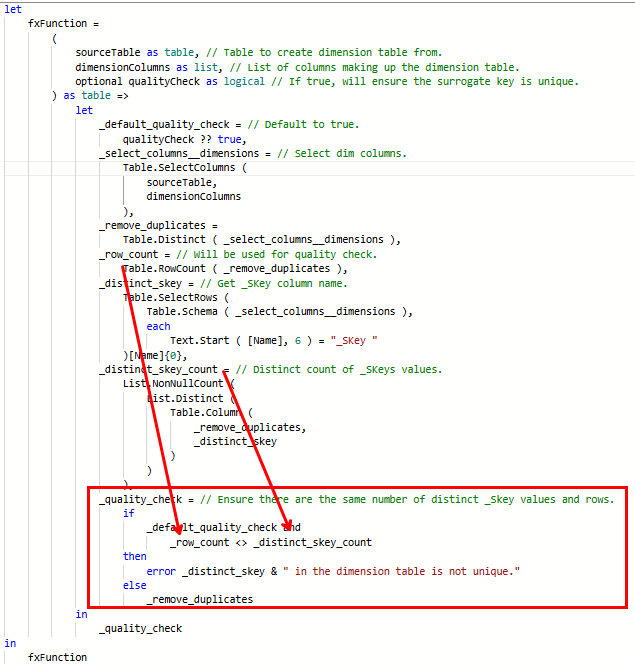

## Introduction

Having your dataflows or semantic models fail to refresh can be frustrating, but at least you know that whatever caused the error did not make it into your production assets. Your data might be stale, but you have the ability to go into the code, make the fix, and kick off another refresh.

Something else much scarier should keep you up at night; you make a mistake in the logic of your code that results in incorrect data, the refresh doesn't fail, and your users use that bad data to make decisions. 😱

I don't know about you, but I'd rather have a refresh failure.

Rest assured; you can avoid these situations by adding custom data quality tests to you Power Query queries.

## What are data quality tests?

When preparing our data in Power Query, we make certain assumptions about the data, which informs the way we go about performing the needed transformations.

Sometimes our assumptions are correct at first, but something changes in the data later on which makes our assumptions wrong. Other times we were just wrong in the first place.

In order to validate our assumptions, we can add data quality tests to our code.

I love this definition of data tests from [Data Quality Testing: 7 Essential Tests (montecarlodata.com)](https://www.montecarlodata.com/blog-data-quality-testing/):

> Like all software and data applications, ETL/ELT systems are prone to failure from time-to-time. So, data quality testing is the process of validating that key characteristics of a dataset match what’s expected prior to consumption by downstream users.

One of the best ways to add a data quality test is to check a condition. If the condition is true, continue on with the rest of the steps. If the condition is false, raise an error. (Yes, on purpose!)

It might look something like this. Consider this function that adds two unequal numbers together:

```powerquery
(
    A as number,
    B as number
) as number =>
    let
        _result = A + B,
        _test_result =
            if
                A <> B
            then
                _result
            else
                error "A: " & Number.ToText ( A ) & " cannot equal B: " & Number.ToText ( B )
    in
        _test_result
```


While it is a silly example, it shows how you can test to make sure that the expected output occurs. If it does not, you can raise an error and send a custom message to the developer.

Adding these tests will cause your refresh to fail, but it stops bad data from getting to your users.

You can learn more about error handling here: [M Language Error Handling - PowerQuery M | Microsoft Learn](https://learn.microsoft.com/en-us/powerquery-m/m-spec-error-handling).

## Examples of data quality tests

While there are endless possibilities when it comes to adding data quality tests to your Power Query project, here are two that I have implemented in the past.

**Example 1:**

The first one is included in one of the custom functions I wrote about earlier this year: [Custom M Function #1: fxJoinAndExpandTable – DAX Noob](https://daxnoob.blog/custom-m-function-1-fxjoinandexpandtable/).

This function makes it easier to join two tables together. The function uses a left join, which has the potential to return more records than exist in the original left table. This can cause many issues in the quality of your data, including duplicating/inflating fact table records leading it incorrect reports.

To avoid this, I run a test to ensure the row count before and after the join is the same.


**Example 2:**

The second example is in a function that I wrote to create a dimension table from another table. I'll dedicate an entire post to it in the future.

The basic logic is: select the dimension columns from a table (including the surrogate key) and perform a Table.Distinct on the entire table.

If that were the entire logic, there is nothing guaranteeing that the surrogate key is unique.

For example, I maybe have based the generation of the surrogate key on the combinations of columns A and B and assumed that there was a one-to-many relationship between C and B.

If that assumption is true, I should be fine. But if there is a many-to-many relationship between B and C. I am in trouble.

When I go to create a dimension table from _SKey A+B, A, B, and C and perform a Table.Distinct on the entire table, the _SKey A+B column will no longer be unique.

Adding a data quality test to ensure that the final row count equals the distinct count of the _SKey column ensures that this is not the case.



## Conclusion

Like always, if you have any questions or feedback, please reach out. I'd love to hear from you!
