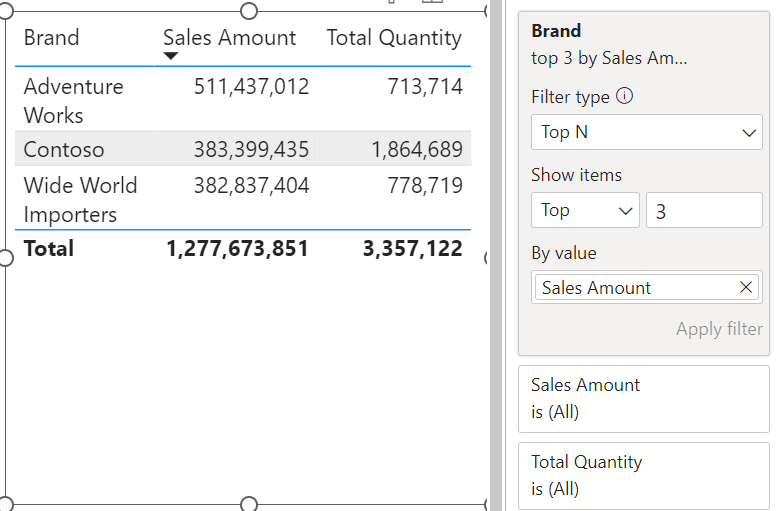
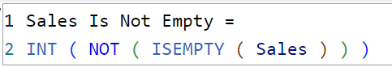
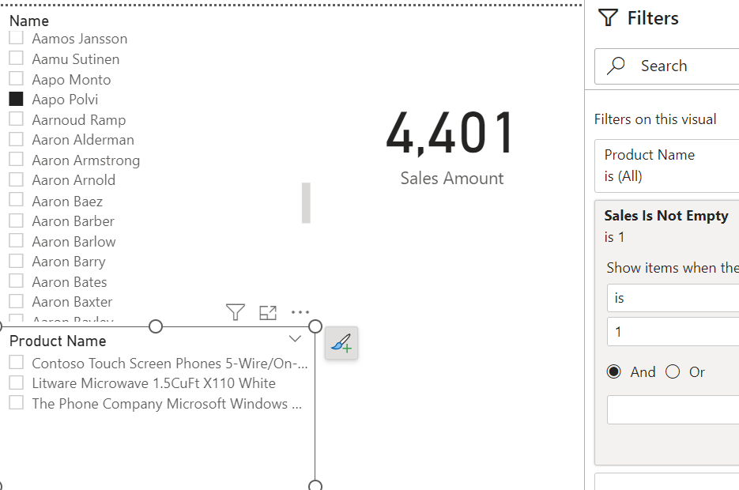

## Introduction

One of the features I love in Power BI that I don't think gets enough love is the ability to use measures as filters on a visual. Unlike page or report filters, which have to be applied on columns in a table, visual filters can be applied to either columns or measures.

For example, let's say I only want to display a list of brands and their total sales but only include brands that have had over $100M in sales. You can do so by adding a filter condition on the measure like shown below:

You might be asking... so what?

Well, hold on to your hats! You can also remove Sales Amount from the visual and the filter still applies! 🤯

You still might be asking... so what?

It might not seem like much, but I frequently run into patterns that greatly benefit from this seemingly simple feature. The ability to filter a visual by a measure that isn't being displayed can be a very powerful tool.

I've included a couple of those patterns below.

## Pattern 1: A non-Top N measure result

By default, you can apply a Top N filter on a field based on another measure like shown below:

But what if you want to, for example, only display the brands that have greater than the average total sales amount.

You could create new Sales Amount and Total Quantity measures that only return values when the brand in the current filter context is greater than the average...

... OR you could just create **one**measure that you can use as a visual filter.

## Pattern 2: Limiting Slicer Selections

It is often the case that you have two slicers with columns from two different tables on your report.

The problem is, when you select a value from one slicer, the other slicer is unaffected.

This occurs because the filter is not passed from the Customer table to the Product table, resulting in the user having to randomly select values from the second slicer hoping to find a valid selection (talk about a terrible user experience).

A common choice made to solve this is to enable bi-directional filters. Unless you want to make Marco and Alberto sad, **don't do this**.

SQLBI has a great article explaining some of the problems that occur when using bi-directional filters. Check it out [here](https://www.sqlbi.com/articles/bidirectional-relationships-and-ambiguity-in-dax/).

A better way to dynamically limit the slicer selections is to apply a visual level filter that checks if there are records in the fact table.

You can achieve the same result by creating a measure that performs a simple aggregation on the fact table, adding it to the visual filter section and set the filter condition to IS NOT BLANK.

SQLBI also has a great article that goes over this pattern in depth. You can find it [here](https://www.sqlbi.com/articles/syncing-slicers-in-power-bi/).

## Conclusion

How else have you used measures as visual filters? What other use cases can you think of? I'm sure there are tons more!

Like always, if you have any questions or feedback, please reach out.  I'd love to hear from you!
