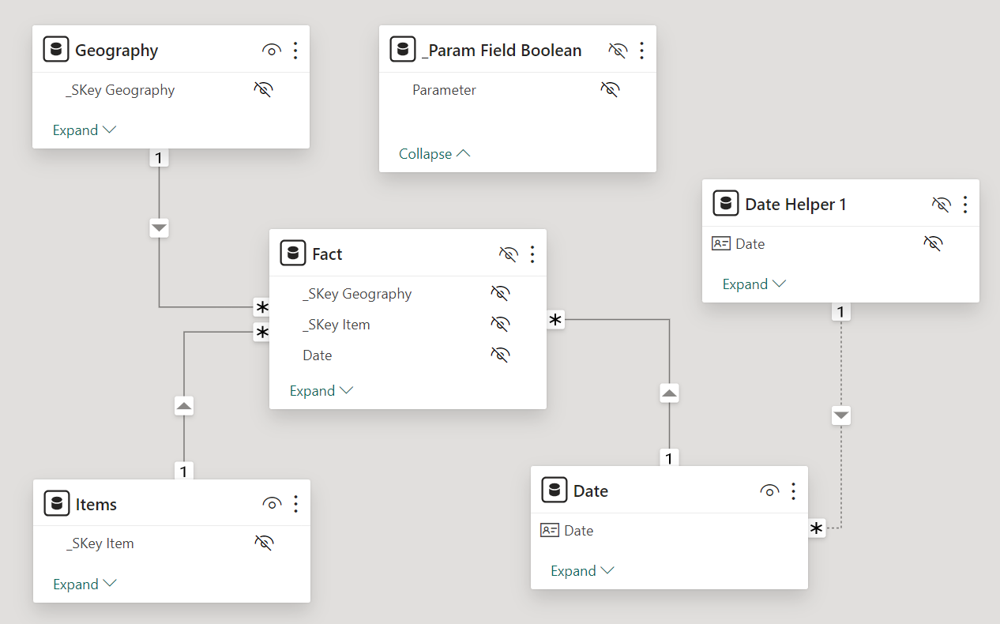
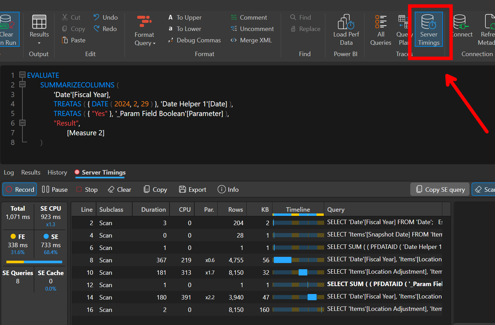
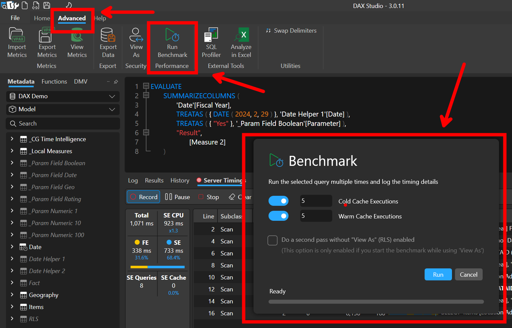
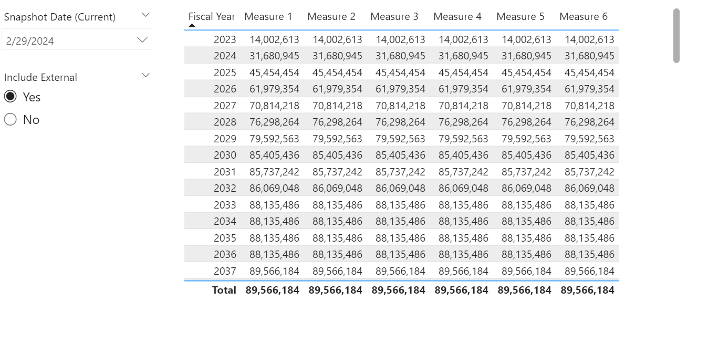
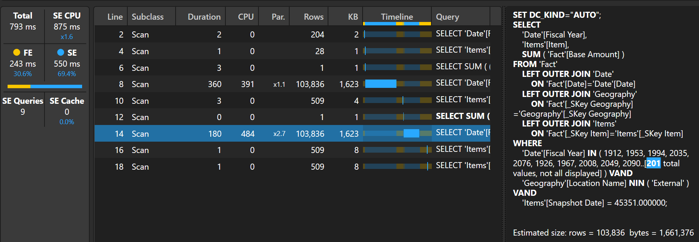
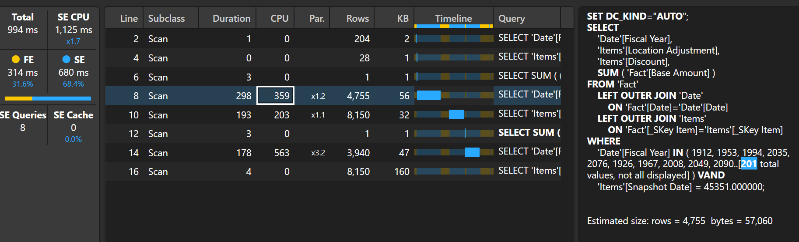
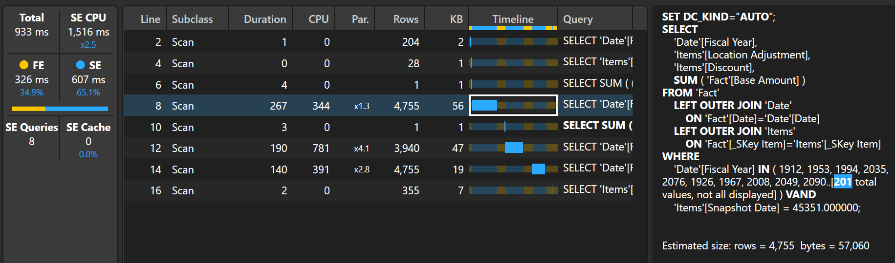
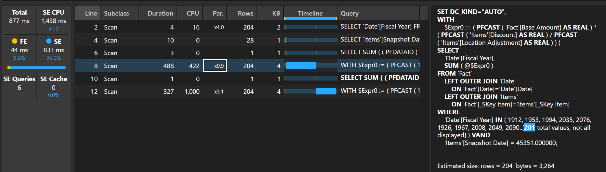
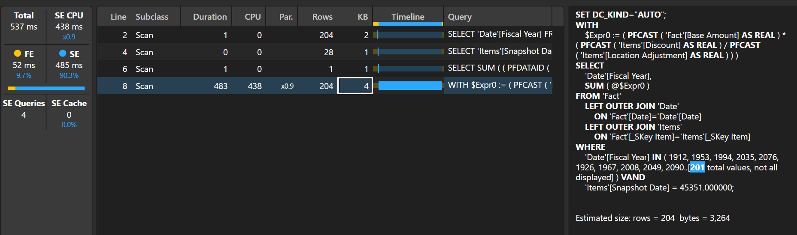
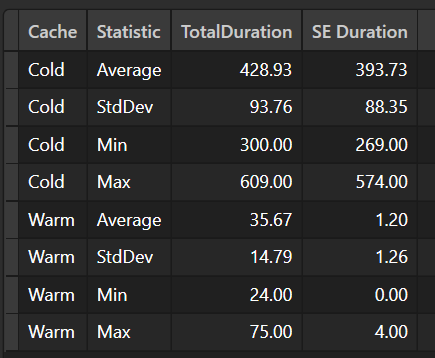

## Introduction

When working with DAX, there are many ways to get the same result, but performance can vary greatly. If you are anything like me, you want your code to be as performant as possible. Sometimes you have a good idea about what pattern is best and other times you don’t. There are even times when you think you know what’s best but are completely wrong.

It all comes down to how the DAX engine answers the query. You can have good guesses, **but you don’t know until you test it on your model.**

Below is a short recap of a recent attempt to optimize a measure I created while building a report for my stakeholders.

## The Requirements

***Note:** The actual requirements, tables, fields, etc. are not listed below and have been anonymized. Also, I increased the fact table size to just over 1 billion records to make it easier to see differences in performance.

- I had to update an existing measure that gave the running total of the "Base Amount" column by fiscal year.
- The data was snapshotted, and the user needed to be able to select which snapshot they wanted to view.
- The user needed to be able to include or exclude external locations.
- Each item on the "Item" table has a discount and location adjustment that needed to be factored into the calculation.

**The model:**



```dax
The original measure:
VAR _selected_snapshot_date =
    [User Selection - Snapshot Date (Current)]
VAR _include_external_flag =
    SELECTEDVALUE ( '_Param Field Boolean'[Parameter] )
VAR _date_window =
    WINDOW (
        1,
        ABS,
        0,
        REL,
        ALL ( 'Date'[Fiscal Year] ),
        ORDERBY ( 'Date'[Fiscal Year], ASC )
    ) 
VAR _calc_with_external=
    CALCULATE (
        SUM ( 'Fact'[Base Amount] ),
        _date_window,
        'Items'[Snapshot Date] = _selected_snapshot_date
    )
VAR _calc_without_external =
    CALCULATE (
        SUM ( 'Fact'[Base Amount] ),
        _date_window,
        'Items'[Snapshot Date] = _selected_snapshot_date,
        KEEPFILTERS ( Geography[Location Name] <> "External" )
    )    
VAR _dynamic_calc =
    IF (
        _include_external_flag = "Yes",
        _calc_with_external,
        _calc_without_external
    )
RETURN
    _dynamic_calc
```

## The Process

When trying to optimize DAX measures, the most important thing is accuracy. It doesn't matter if you write a measure that is faster than the original measure and the results are different. **If the results are different, you haven't optimized anything.**

For each version of the measure, I did the following:

- Write the initial algorithm
- Ensure the results are the same
- Use DAX Studio to run a benchmark analysis (15 runs of cold and warm cache executions) and review the server timings

I used the following query, replacing the measure reference, to test the performance:

```dax
EVALUATE
    SUMMARIZECOLUMNS (
        'Date'[Fiscal Year], 
        TREATAS ( { DATE ( 2024, 2, 29 ) }, 'Date Helper 1'[Date] ),
        TREATAS ( { "Yes" }, '_Param Field Boolean'[Parameter] ),
        "Result", 
            [Measure 2]
    )
```

In DAX Studio, you can enable server timings here:



And run a benchmark analysis here:



I ended up creating 6 versions of the measure. My notes are included below.

Just to confirm that the results were the same for each measure:



## Measure 1

```dax
Measure:
VAR _selected_snapshot_date =
    [User Selection - Snapshot Date (Current)]
VAR _include_external_flag =
    SELECTEDVALUE ( '_Param Field Boolean'[Parameter] )
VAR _date_window =
    WINDOW (
        1,
        ABS,
        0,
        REL,
        ALL ( 'Date'[Fiscal Year] ),
        ORDERBY ( 'Date'[Fiscal Year], ASC )
    ) 
VAR _calc =
    SUMX (
        VALUES ( 'Items'[Item] ),
        VAR _discount =
            CALCULATE (
                MAX ( 'Items'[Discount] ),
                'Items'[Snapshot Date] = _selected_snapshot_date
            )
        VAR _location_adjustment =
            CALCULATE (
                MAX ( 'Items'[Location Adjustment] ),
                'Items'[Snapshot Date] = _selected_snapshot_date
            )                
        VAR _calc_with_external=
            CALCULATE (
                SUM ( 'Fact'[Base Amount] ),
                _date_window,
                'Items'[Snapshot Date] = _selected_snapshot_date
            )
        VAR _calc_without_external =
            CALCULATE (
                SUM ( 'Fact'[Base Amount] ),
                _date_window,
                'Items'[Snapshot Date] = _selected_snapshot_date,
                KEEPFILTERS ( Geography[Location Name] <> "External" )
            )    
        VAR _dynamic_calc =
            IF (
                _include_external_flag = "Yes",
                _calc_with_external,
                _calc_without_external
            )
        VAR _apply_pue_util_factor =
            _dynamic_calc *  DIVIDE ( _discount, _location_adjustment )
        RETURN
            _apply_pue_util_factor
    )
RETURN
    _calc
```

**Server Timings:**




**Quick Observations:**
Because each item can have a different discount and location adjustment, I took the existing logic, put it in a SUMX function, and then used the context transition feature of CALCULATE to get the discount and location adjustment for each item.

There are two larger scans (about 103k each) that both return the sum of the Base Amount grouped by Fiscal Year and Item. This is probably due to the _calc_with_external and _calc_without_external parts of the query.

When using the cache (warm), the SE duration is close to 0 but there is still a decent amount of formula engine time remaining (TotalDuration - SE Duration).

## Measure 2

```dax
Measure:
VAR _selected_snapshot_date =
    [User Selection - Snapshot Date (Current)]
VAR _include_external_flag =
    SELECTEDVALUE ( '_Param Field Boolean'[Parameter] )
VAR _date_window =
    WINDOW (
        1,
        ABS,
        0,
        REL,
        ALL ( 'Date'[Fiscal Year] ),
        ORDERBY ( 'Date'[Fiscal Year], ASC )
    ) 
VAR _calc =
    SUMX (
        CALCULATETABLE (
            SUMMARIZE (
                'Fact',
                'Items'[Discount],
                'Items'[Location Adjustment]
            ),
            REMOVEFILTERS ( 'Date'[Fiscal Year] )
        ),
        VAR _discount =
            CALCULATE ( MAX ( 'Items'[Discount] ) )
        VAR _location_adjustment =
            CALCULATE ( MAX ( 'Items'[Location Adjustment] ) )
        VAR _calc_with_external=
            CALCULATE (
                SUM ( 'Fact'[Base Amount] ),
                _date_window,
                'Items'[Snapshot Date] = _selected_snapshot_date
            )
        VAR _calc_without_external =
            CALCULATE (
                SUM ( 'Fact'[Base Amount] ),
                _date_window,
                'Items'[Snapshot Date] = _selected_snapshot_date,
                KEEPFILTERS ( Geography[Location Name] <> "External" )
            )    
        VAR _dynamic_calc =
            IF (
                _include_external_flag = "Yes",
                _calc_with_external,
                _calc_without_external
            )
        VAR _apply_pue_util_factor =
            _dynamic_calc *  DIVIDE ( _discount, _location_adjustment )
        RETURN
            _apply_pue_util_factor
    )
RETURN
    _calc
```

**Server Timings:**




**Quick Observations:**
I thought this one would be faster than Measure 1 because it was only iterating over the combinations of discounts and location adjustments, **but I was wrong.** There are three scan that, while returning fewer rows, take a longer amount of time.

## Measure 3

```dax
Measure:
VAR _selected_snapshot_date =
    [User Selection - Snapshot Date (Current)]
VAR _include_external_flag =
    SELECTEDVALUE ( '_Param Field Boolean'[Parameter] )
VAR _date_window =
    WINDOW (
        1,
        ABS,
        0,
        REL,
        ALL ( 'Date'[Fiscal Year] ),
        ORDERBY ( 'Date'[Fiscal Year], ASC )
    ) 
VAR _calc =
    CALCULATE (
        SUMX (
            SUMMARIZE (
                'Fact',
                'Items'[Discount],
                'Items'[Location Adjustment]
            ),
            VAR _discount =
                CALCULATE ( MAX ( 'Items'[Discount] ) )
            VAR _location_adjustment =
                CALCULATE ( MAX ( 'Items'[Location Adjustment] ) )
            VAR _calc_with_external=
                CALCULATE ( SUM ( 'Fact'[Base Amount] ) )
            VAR _calc_without_external =
                CALCULATE (
                    SUM ( 'Fact'[Base Amount] ),
                    KEEPFILTERS ( Geography[Location Name] <> "External" )
                )    
            VAR _dynamic_calc =
                IF (
                    _include_external_flag = "Yes",
                    _calc_with_external,
                    _calc_without_external
                )
            VAR _apply_pue_util_factor =
                _dynamic_calc *  DIVIDE ( _discount, _location_adjustment )
            RETURN
                _apply_pue_util_factor
        ),
        _date_window,
        'Items'[Snapshot Date] = _selected_snapshot_date 
    )
RETURN
    _calc
```

**Server Timings:**




**Quick Observations:**
Moving the date window and snapshot date filters to the outer calculate reduced the scan size slightly. Performance it relatively better.

## Measure 4

```dax
Measure:
VAR _selected_snapshot_date =
    [User Selection - Snapshot Date (Current)]
VAR _include_external_flag =
    SELECTEDVALUE ( '_Param Field Boolean'[Parameter] )
VAR _date_window =
    WINDOW (
        1,
        ABS,
        0,
        REL,
        ALL ( 'Date'[Fiscal Year] ),
        ORDERBY ( 'Date'[Fiscal Year], ASC )
    )
VAR _calc =
    CALCULATE (
        VAR _calc_with_external =
            SUMX (
                'Fact',
                'Fact'[Base Amount] *
                    DIVIDE (
                        RELATED ( 'Items'[Discount] ),
                        RELATED ( 'Items'[Location Adjustment] )
                    )
            )
        VAR _calc_without_external =
            CALCULATE (
                SUMX (
                    'Fact',
                    'Fact'[Base Amount] *
                        DIVIDE (
                            RELATED ( 'Items'[Discount] ),
                            RELATED ( 'Items'[Location Adjustment] )
                        )
                ),
                KEEPFILTERS ( Geography[Location Name] <> "External" )  
            ) 
        VAR _dynamic_calc =
            IF (
                _include_external_flag = "Yes",
                _calc_with_external,
                _calc_without_external
            )
        RETURN
            _dynamic_calc,
        _date_window,
        'Items'[Snapshot Date] = _selected_snapshot_date               
    )
RETURN
    _calc
```

**Server Timings:**


**Quick Observations:**
I realized that I was too fixated on keeping a similar pattern I had in the original measure that I forgot to experiment with other patterns. Here, I tried to change up the algorithm more substantially by iterating over the fact table and getting the discount and location modifier by using the RELATED function. Also, I kept the date window and snapshot date filters to the outer calculate based on what I saw in Measure 3.

Although this one was a bit slower, most of the time was spent in the storage engine. Unfortunately, this measure doesn't benefit from the cache. This is probably due to the presence of the CallbackDataID in some of the scans. The issue here is that the storage engine doesn't know how to answer the DIVIDE function. With a slight modification to the code, we should be able to remove the need for the callback.

## Measure 5

```dax
Measure:
VAR _selected_snapshot_date =
    [User Selection - Snapshot Date (Current)]
VAR _include_external_flag =
    SELECTEDVALUE ( '_Param Field Boolean'[Parameter] )
VAR _date_window =
    WINDOW (
        1,
        ABS,
        0,
        REL,
        ALL ( 'Date'[Fiscal Year] ),
        ORDERBY ( 'Date'[Fiscal Year], ASC )
    )
VAR _calc =
    CALCULATE (
        VAR _calc_with_external =
            SUMX (
                'Fact',
                'Fact'[Base Amount] *
                    (
                        RELATED ( 'Items'[Discount] ) /
                        RELATED ( 'Items'[Location Adjustment] )
                    )
            )
        VAR _calc_without_external =
            CALCULATE (
                SUMX (
                    'Fact',
                    'Fact'[Base Amount] *
                        (
                            RELATED ( 'Items'[Discount] ) /
                            RELATED ( 'Items'[Location Adjustment] )
                        )
                ),
                KEEPFILTERS ( Geography[Location Name] <> "External" )  
            ) 
        VAR _dynamic_calc =
            IF (
                _include_external_flag = "Yes",
                _calc_with_external,
                _calc_without_external
            )
        RETURN
            _dynamic_calc,
        _date_window,
        'Items'[Snapshot Date] = _selected_snapshot_date               
    )
RETURN
    _calc
```

**Server Timings:**




**Quick Observations:**
By removing the DIVIDE function and simply using the division operator, the callback function was removed, and the DAX engine uses almost exclusively the storage engine to answer the query. Since I know that a local adjustment can't be 0, I am confident that this change won't return risk returning a divide by 0 answer.

## Measure 6

```dax
Measure:
VAR _selected_snapshot_date =
    [User Selection - Snapshot Date (Current)]
VAR _include_external_flag =
    SELECTEDVALUE ( '_Param Field Boolean'[Parameter] )
VAR _date_window =
    WINDOW (
        1,
        ABS,
        0,
        REL,
        ALL ( 'Date'[Fiscal Year] ),
        ORDERBY ( 'Date'[Fiscal Year], ASC )
    )
VAR _location_filter =
        FILTER (
            VALUES ( Geography[Location Name] ),
            _include_external_flag = "Yes" ||
                Geography[Location Name] <> "External"
        )
VAR _calc =
    CALCULATE (
        SUMX (
            'Fact',
            'Fact'[Base Amount] *
                (
                    RELATED ( 'Items'[Discount] ) /
                    RELATED ( 'Items'[Location Adjustment] )
                )
        ),
        _date_window,
        'Items'[Snapshot Date] = _selected_snapshot_date,
        _location_filter                   
    )
RETURN
    _calc
```

**Server Timings:**





**Quick Observations:**
To improve performance even more, I tried to modify the code to avoid two scans of the Fact table. By moving the external location filter to the top and only having one SUMX function, I was able to significantly reduce the SE time.

## Conclusion

It seems like I found a winner with Measure 6. With a different dataset, the results might have been different. **You don't know unless you test it.**
 Like always, if you have any questions or feedback, please reach out. I'd love to hear from you!

P.S. - If you have some suggestions on how to improve the performance of the measure, I'd love it hear them.
