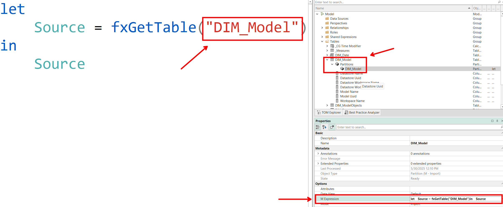

## Introduction

In an internal Microsoft Fabric support channel, someone asked, "My customer has multiple workspaces, each containing several semantic models. They are looking for a way to list all tables within each semantic model without manually opening each one."

Described below is an easy way to extract all of the source tables from multiple semantic models using Fabric notebooks.

## The Challenge

When trying to identify the source table of a semantic model table, you need a way to look at the table's metadata. You can do this in several ways: looking at the M expression in the Power Query Editor (Import/Direct Query), TMDL view, Tabular Editor, Fabric Notebook, etc.

And depending on the table type, the source table will be found in different locations. For Direct Lake models, the source table name will be the "Entity Name" property found in the Entity partition associated with the semantic model table.


For Import Models, the source table name will be found somewhere in the M expression on the M partition.



As you can see, it is a little simpler to get the source table name from a Direct Lake table than an Import/Direct Query table because depending on your data source and how you wrote your M expressions, the source tables could show up in different ways.

And to top it all off, going through this process manually for even a single large model could be very tedious.

## The Solution

Using Fabric notebooks, we can easily automate the process retrieving these properties from any number of models we want.

The notebook below does the following:
1. Imports needed libraries
2. Defines the target workspaces to extract the model metadata
3. Defines the regex patterns used to extract the table names from Import/Direct Query M expressions (this will be highly customized based on how your expressions are defined)
4. For each workspace, connect to the TOM server
5. For each model in the TOM server, loop through each table and partition
6. For each partition, extract the EntityName if it exists
7. If not, (which means we are working with an Import/Direct Query model) extract the matching regex pattern from the M expression
8. If there is no matching pattern, return the entire M expression
9. Return all processed tables as a dataframe and display to the user

***NOTE***: This notebook does not attempt to extract the data source information, e.g., Lakehouse name, SQL connection string, etc. If someone wants to update the notebook to add this functionality, please share it with the rest of us🙂.

```python
import re
import pandas as pd
import sempy.fabric as fabric
from typing import List, Optional

workspaces = [
    'Workspace 1',
    'Workspace 2',
]
m_expression_patterns = [
    r'',
]

def get_table_sources_from_workspaces(
    workspaces: List[str],
    expr_patterns: Optional[List[str]] = None
) -> pd.DataFrame:
    """
    Retrieve source tables for all Fabric semantic models in the given workspaces.

    :param workspaces: List of workspace names.
    :param expr_patterns: Optional list of regex strings to extract names from M expressions.
    :return: pandas DataFrame with columns: workspace, model_name, table_name, source_table_name.
    """
    patterns = [re.compile(p) for p in (expr_patterns or [])]
    records = []

    for ws in workspaces:
        server = fabric.create_tom_server(readonly=True, workspace=ws)
        dataset_names = fabric.list_datasets(workspace=ws)['Dataset Name']

        for model_name in dataset_names:
            model = server.Databases.GetByName(model_name).Model

            for table in model.Tables:
                for part in table.Partitions:
                    src = part.Source
                    source = getattr(src, 'EntityName', None)
                    if not source:
                        expr = getattr(src, 'Expression', '') or ''
                        for pat in patterns:
                            m = pat.search(expr)
                            if m:
                                source = m.group(1)
                                break
                        source = source or expr or None

                    records.append({
                        'workspace': ws,
                        'model_name': model_name,
                        'table_name': table.Name,
                        'source_table_name': source,
                    })

    df = pd.DataFrame(records)
    return df.sort_values(['workspace', 'model_name', 'table_name']).reset_index(drop=True)

df = get_table_sources_from_workspaces(workspaces, m_expression_patterns)
display(df)
```

## Example

I want to run the notebook on the following workspaces:

```
workspaces = [
    'HelixFabric-Insights',
    'HelixFabric-Operations',
]
```

And my Import models normally have an M expression pattern that uses a UDF called "fxGetTable" to extract a table from a data source defined in a shared M expression. So, I will add the following regex pattern:

```
m_expression_patterns = [
    r'fxGetTable\("([^"]+)"\)',
]
```

After running the notebook, I get the following results:

**Records from one of the Direct Lake models**


**Records from one of the Import models**

As you can see here, many of the tables' M expressions had a matching pattern and the notebook was able to successfully extract the source table name. A few didn't have any matches, like the DIM_Date table which doesn't pull from an external source but is completely built in M.


## Conclusion

I hope you find this notebook helpful.

Like always, if you have any questions or feedback, please reach out. I'd love to hear from you!
