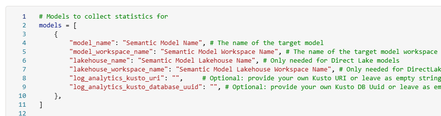
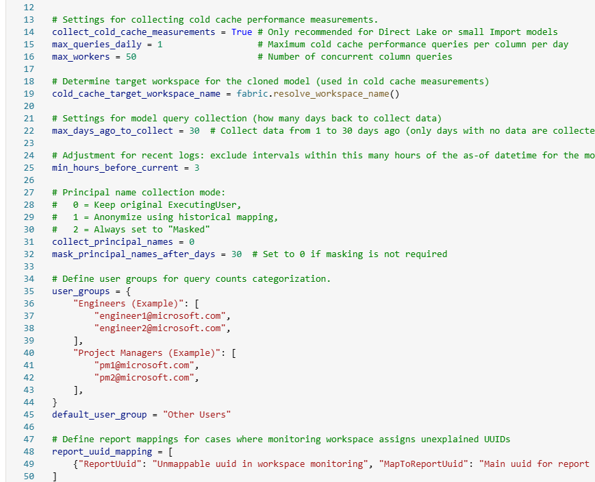

## Introduction

Another role of the Azure Data Insights & Analytics team is building and maintaining the internal analytics and reporting for Azure Data. My job is to develop, maintain and optimize the Semantic Models that support our reporting. In order to monitor and audit our models' performance, we developed a tool called [Semantic Model Audit](https://github.com/microsoft/fabric-toolbox/tree/main/tools/SemanticModelAudit), which is now available in the Fabric Toolbox open-source GitHub repo.

## Overview

This tool is designed to provide a comprehensive audit of your Fabric semantic models.

The tool consists of three main components:

1. **The Notebook:**
    - Captures model metadata, query logs, dependencies, unused columns, cold cache performance, and resident statistics.
    - Generates star schema tables (DIM_ModelObject, DIM_Model, DIM_Report, DIM_User, FACT_ModelObjectQueryCount, FACT_ModelLogs, FACT_ModelObjectStatistics) stored in a lakehouse.
    - Includes robust error handling, scheduling, and clean-up functions to support continuous monitoring.
2. **The Power BI Template (PBIT File):**
    - Creates an interactive report from the star schema tables generated by the notebook.
    - Allows you to explore model performance, usage trends, and metadata changes through intuitive visuals.
    - Provides a ready-to-use template that you can customize further in Power BI Desktop.
3. **The PowerPoint File:**
    - Contains the background images and design elements used in the Power BI template.

## Requirements

1. **Workspace Monitoring:**
    - Ensure that Workspace Monitoring is enabled in your Fabric environment.
    - Refer to [this blog post](https://blog.fabric.microsoft.com/blog/announcing-public-preview-of-workspace-monitoring) for setup guidance.
2. **Scheduled Execution:**
    - Schedule the notebook to run several times a day (e.g., six times) for detailed historical tracking.
    - Update run parameters (model names, workspaces, logging settings) at the top of the notebook.
3. **Lakehouse Attachment:**
    - Attach the appropriate Lakehouse in Fabric to store logs and historical data in Delta tables.

## Key Features

1. **Model Object & Metadata Capture:**
    - Retrieves and standardizes the latest columns and measures using Semantic Link and Semantic Link Labs.
    - Captures dependencies among model objects to get a comprehensive view of object usage.
2. **Query Log Collection:**
    - Captures both summary query counts and detailed DAX query logs.
3. **Unused Column Identification:**
    - Compares lakehouse and model metadata to identify unused columns in your model's source lakehouse.
    - Removing unused columns will result in greater data compression and performance.
4. **Cold Cache & Resident Statistics:**
    - Deploys a cloned model to measure cold cache performance.
    - Records detailed resident statistics (e.g., memory load, sizes) for each column.
5. **Star Schema Generation:**
    - Produces a set of star schema tables, making it easy to integrate with reporting tools.
6. **Integrated Reporting Assets:**
    - **Power BI Template (PBIT):** Quickly generate an interactive report from the captured data.
    - **PowerPoint File:** Provides background images and design elements used in the report.

## Why Use This Notebook?

- **Consistent Testing**: Automates cache clearing and capacity pausing for reliable comparisons.
- **Scalable**: Run as many queries as you want, any number of times as needed against your models and track each attempt.
- **Centralized Logs**: All results are stored in a Lakehouse for easy analysis.
- **Versatility**: Some use cases include: testing different DAX measure versions, comparing the impact of model changes on DAX performance, comparing performance across storage modes, etc.

## Getting Started

Download the notebook from GitHub and upload to a Fabric workspace.

Attach a Lakehouse that will be used to save the logs.

Update the list of models you want to audit.

Configure the rest of the settings in the config cell. There are a lot of options, so read carefully. 🙂

Run the notebook and collect the logs. Under the collect_model_statistics() cell, you can track along with the testing if you want to understand what is happening.

After the first run has finished, download the PBIT file and connect to your lakehouse.

## Conclusion

I hope you find this notebook helpful.

Like always, if you have any questions or feedback, please reach out. I'd love to hear from you!
