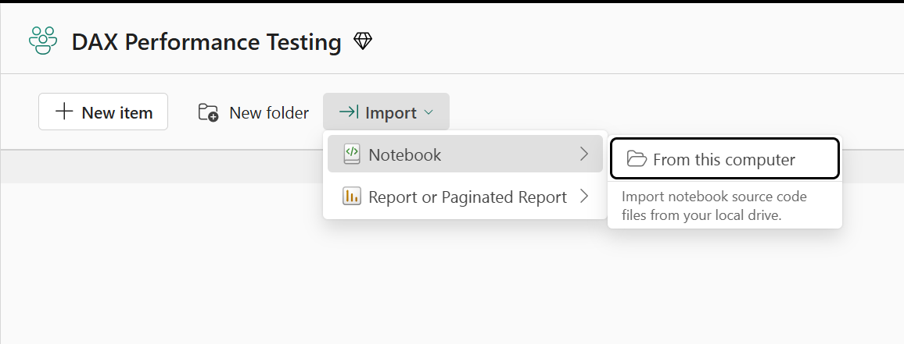
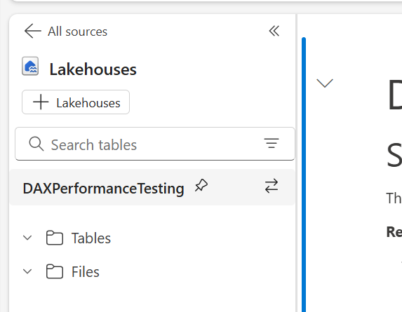
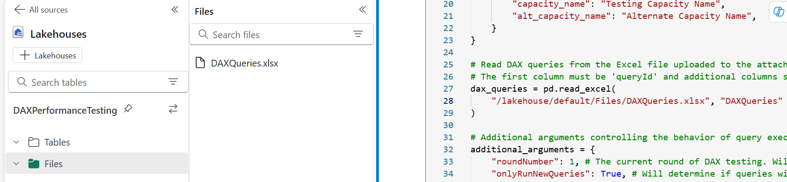
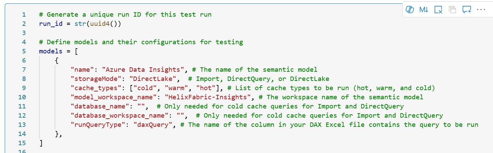
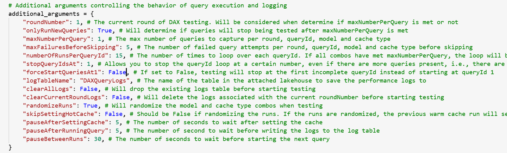
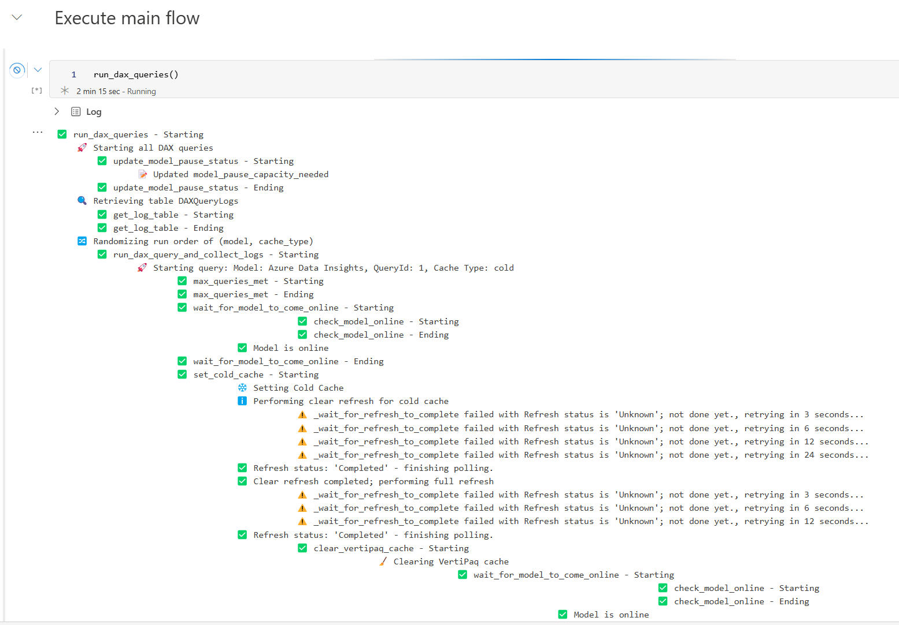
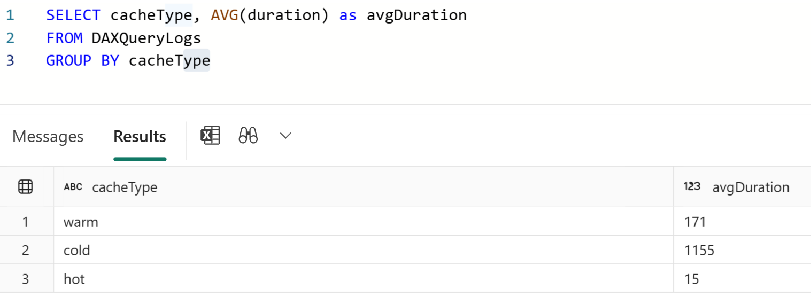

## Introduction

Part of the role of the Azure Data Insights & Analytics team is to test new features and provide feedback to our engineering and product teams. However, manual testing quickly becomes time-consuming and prone to error, so we develop tools and processes that let us automate and scale our testing efforts. We realized these tools and other frameworks that our team has developed could benefit others as well, so we will be sharing them with the Fabric community through the [Fabric Toolbox](https://github.com/microsoft/fabric-toolbox) open-source repo.

The first tool in this repo is the **[DAX Performance Testing](https://github.com/microsoft/fabric-toolbox/tree/main/tools/DAXPerformanceTesting)** notebook, which automatically runs a series of DAX queries on your models under different cache states, then saves the results to an attached Lakehouse.

## Overview of the Notebook

This notebook takes an Excel file with DAX queries, runs them under cold, warm, and hot cache states, and logs the results in a Lakehouse table.

**Key Features:**

1. **Model Definitions**
    - The definitions for models to be tested are stored in a dictionary, specifying storage mode, workspace, and cache states to test.
2. **Query Input**
    - Queries are pulled from an Excel file in your Lakehouse. Each query needs an ID and at least one column that matches the runQueryType in the model definition.
3. **Different Cache States**
    - **Cold Cache**: Clears all cache. For Import/Direct Query, this involves pausing capacity, reassigning workspaces, and clearing VertiPaq cache. For DirectLake, it triggers a dataset clearValues refresh and then a full refresh. For Direct Query, the way cold-cache is set assumes that your data store is in a Fabric workspace, e.g., Lakehouse, Warehouse, etc.
    - **Warm Cache**: Partial caching. For Direct Query, we set cold-cache first, then run a query to “prime” the model. For Import and Direct Lake, we ensure all columns are framed by running the target query, then we clear the Vertipaq cache.
    - **Hot Cache**: Runs the query twice before measuring the third time to ensure columns are framed and all caches are set.
4. **Capacity Pause/Resume**
    - ****Warning****: Pausing a capacity will interrupt any running workloads on that capacity. Resuming will take time and resources, and can affect other workspaces assigned to the same capacity.
    - For cold-cache queries on Import and DirectQuery models, the notebook pauses and resumes capacities to ensure truly cold-cache testing. Configure your workspace capacities in the config cell if using this feature.
5. **Logging to Lakehouse**
    - Query logs are captured using an Analysis Services trace and stored in your attached Lakehouse. This includes duration, CPU time, and success/failure status.

## Why Use This Notebook?

- **Consistent Testing**: Automates cache clearing and capacity pausing for reliable comparisons.
- **Scalable**: Run as many queries as you want, any number of times as needed against your models and track each attempt.
- **Centralized Logs**: All results are stored in a Lakehouse for easy analysis.
- **Versatility**: Some use cases include: testing different DAX measure versions, comparing the impact of model changes on DAX performance, comparing performance across storage modes, etc.

## Getting Started

1. [Download the notebook from GitHub](https://github.com/microsoft/fabric-toolbox/blob/main/tools/DAXPerformanceTesting/DAXPerformanceTesting.ipynb) and upload to a Fabric workspace.

2. Attach a Lakehouse that will be used to save the logs and host the query list.

3. Add an Excel file with your query list to the Lakehouse. One column must be named "queryId" and there can be as many other columns as you want containing the DAX queries. You will assign one query column to each model. The same column can be used for multiple models. Update the excel file path the with correct file name and worksheet name.

4. Update the list of models you want to test.

5. Configure the rest of the settings in the config cell. You can leave the capacity settings blank if you are not testing cold-cache from Import and/or Direct Query. There are a lot of options, so read carefully. 🙂

6. Run the notebook and collect the logs. Under the run_dax_queries() cell, you can track along with the testing if you want to understand what is happening.

7. Analyze the logs saved in your Lakehouse to compare query results across query versions, cache-states, models, etc.

## Conclusion

I hope you find this notebook helpful.

Like always, if you have any questions or feedback, please reach out. I'd love to hear from you!
