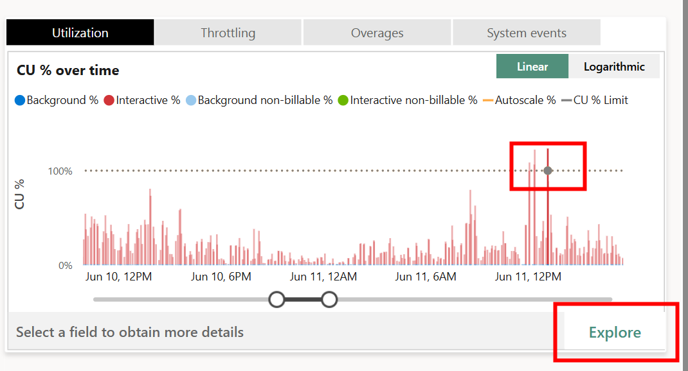
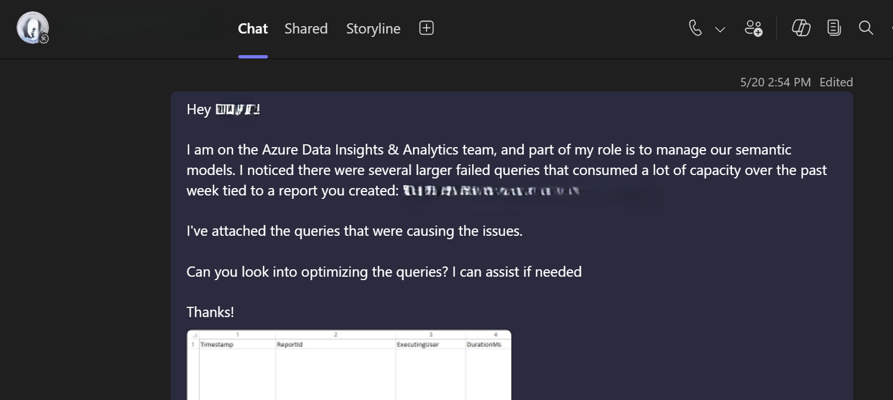

## Introduction

Part of my role is to monitor our team's Fabric capacity utilization, and one of the main tools we use is the Capacity Metrics app. I'm sure this never happens to you 😉, but our semantic models sometimes cause our utilization to cross the 100% threshold. Unfortunately, getting the details you need to identify the root cause of the spike is not so easy in the app.

In this post I will show you how to use the Workspace Monitoring feature to pinpoint what and who caused the spike so you can better manage your capacities.

## The Challenge

Image this... you open your computer to start a nice, productive day of semantic modeling. You naively decide to first check your email, but then you are greeted with this beauty:


Whenever this happens to me, I immediately open the[Fabric Capacity Metrics app](https://learn.microsoft.com/en-us/fabric/enterprise/metrics-app) to try and figure out what and who caused the spike.
Using the utilization chart in the top right-hand section of the report, you can identify the time of the spike and drill down to see more details.




There is a lot of great information on this page, but it doesn't quite give you everything you need. By sorting on the Total CU (s), I can see which model and (sometimes) which user(s) contributed the most towards the spike, but I don't know the report or anything about the actual query. Sometimes, the user field just says "Power BI Service" which leaves you with just the model name. If your model has more than one report bound to it, you are in serious trouble.

## The Solution

If you have Workspace Monitoring enabled ([Announcing preview of Workspace Monitoring](https://blog.fabric.microsoft.com/en-US/blog/announcing-public-preview-of-workspace-monitoring/)), there is no need to panic! From the blog post:

> Workspace monitoring allows Fabric developers and admins to access detailed logs and performance metrics for their workspaces. This helps troubleshoot performance issues, investigate errors, optimize queries, and minimize data downtime. Workspace monitoring provides visibility into operations crucial for observing system health, resource optimization, and operational planning. Insights derived from this data can improve performance tuning, capacity planning, resource allocation, and decision-making, while also aiding compliance and auditing by maintaining detailed logs.

This feature sets up a Kusto database that gives you the ability to query your semantic model's events. There are so many possibilities that open up with Workspace Monitoring (a large portion of the [Semantic Model Audit](https://github.com/microsoft/fabric-toolbox/tree/main/tools/SemanticModelAudit) tool leverages it), but one key benefit is to get more details regarding spikes in your capacity caused by semantic models.

After you have collected the model's name and rough the timepoint where the spike occurred, you can use the following KQL query that you can run to get more information on the events:

```kql
let hour_offset = 5; // Update your UTC offset here to match how you set up your Capacity Metrics app
let model_name = ""; // Enter your model name here
let start_time = datetime(2025-06-11 12:30:00); // Update the start and end time for when the spike occurred
let end_time = datetime(2025-06-11 13:30:00);
let query_end = SemanticModelLogs
  | where Timestamp between (datetime_add('hour', hour_offset, start_time) .. datetime_add('hour', hour_offset, end_time))
    and ItemName == model_name
    and OperationName == "QueryEnd"
  | project Timestamp, OperationId, XmlaSessionId, ExecutingUser, DurationMs, CpuTimeMs, EventText, Status;
let query_begin = SemanticModelLogs
    | where OperationName == "QueryBegin"
    | extend ReportId = extract_json("$.Sources[0].ReportId", tostring(parse_xml(XmlaProperties)["PropertyList"]["ApplicationContext"]), typeof(string))
    | extend VisualId = extract_json("$.Sources[0].VisualId", tostring(parse_xml(XmlaProperties)["PropertyList"]["ApplicationContext"]), typeof(string))
    | distinct ReportId, VisualId, OperationId, XmlaSessionId;
query_end
| join kind=leftouter (query_begin) on OperationId, XmlaSessionId
| project Timestamp = datetime_add('hour', -hour_offset, Timestamp), ReportId, VisualId, ExecutingUser, DurationMs, CpuTimeMs, EventText, Status
| order by CpuTimeMs desc
```

Here it is in action:


We now have many more details than we did before including: the user (if it wasn't there before), the report guid, the visual guid, and even the DAX query!

If your team owns the report, you can now take care of the issue yourself without bothering your users. And if you don't own the report, you can reach out to the user/report owner with more targeted information.

Here is a real-life example of how I used the information generated by the query to resolve the cause of one spike we had.




That was easy! 😉

## Conclusion

I hope you find this post helpful.

Like always, if you have any questions or feedback, please reach out. I'd love to hear from you!
