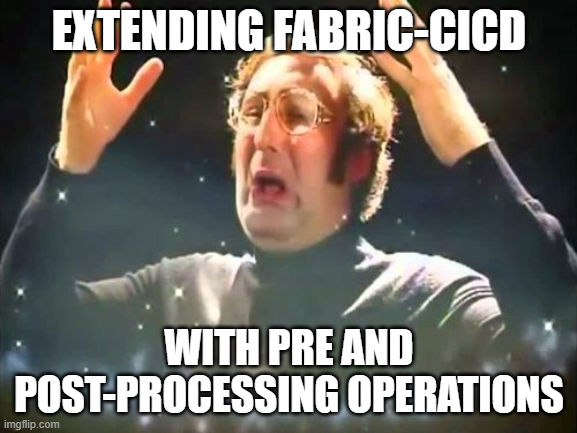
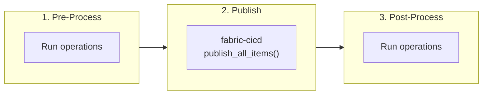
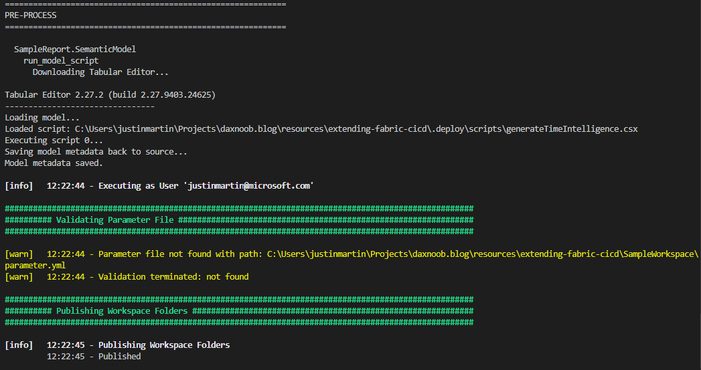
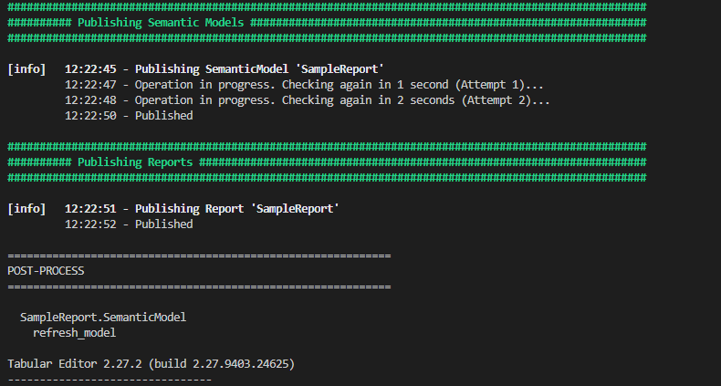

## Introducing the problem



[fabric-cicd](https://github.com/microsoft/fabric-cicd) is a great, code-first method to deploy items to your Fabric workspaces. If you haven't used it yet, [check out this article](https://learn.microsoft.com/en-us/power-bi/developer/projects/projects-deploy-fabric-cicd) that will help you get started.

Even though our team developed the library, it took us a while to adopt it fully because of some limitations.

We build our semantic model deployment process around using the [Tabular Editor](https://tabulareditor.com/) command line, which allows you to run C# scripts before and after deployment to do things like generate measures, run Best Practice Analyzer checks, refresh the model, and other object definitions per environment. For example, instead of source controlling your various time intelligence (TI) measures for each of your base measures, you can simply add an annotation for each of the base measures you want TI measures for and then have a C# script create them all for you on deployment.

fabric-cicd handles the deployment, but doesn't easily provide a way to perform pre or post-processing operations, so we put together a lightweight framework that does just that. In this post, I'll walk through the framework and then demo how we used it to extend our fabric-cicd semantic model deployments with Tabular Editor scripts.

The full source code for the framework and example is on [GitHub](https://github.com/DAXNoobJustin/daxnoob.blog/tree/main/resources/extending-fabric-cicd).

<!-- more -->

## How the Framework Works

The framework adds two phases around fabric-cicd's publish step:



1. **Pre-process** runs against the *local* item definitions before publishing. Generate measures, validate files, change environments, transform definitions, etc.
2. **Publish** uses fabric-cicd to push items to Fabric.
3. **Post-process** runs against the *published* workspace. Refresh models, run live validations, etc.

Everything is driven by a YAML config, so you can customize operations per item type in a central location. The framework works with **any item type** that fabric-cicd supports, not just semantic models.

!!! warning "Pre-process runs locally and modifies your files"
    Pre-process operations run against the *local* item definitions on disk, then fabric-cicd publishes, then post-process runs against the *published* workspace. This means pre-process scripts write changes back to your files. Make sure everything is committed to source control before running locally so you can easily `git checkout` to revert and not mess up your directory. In CI/CD pipelines this isn't an issue because the agent's working copy is disposable.

Full source is in the [sample repo](https://github.com/DAXNoobJustin/daxnoob.blog/tree/main/resources/extending-fabric-cicd).

### Repository Layout

```text
your-repo/
├── SampleWorkspace/
│   ├── SampleReport.SemanticModel/
│   │   ├── .platform
│   │   └── definition/
│   └── SampleReport.Report/
│       ├── .platform
│       └── definition.pbir
└── .deploy/
    ├── deploy_workspace.py          # entry point
    ├── process_orchestrator.py      # pipeline engine
    ├── operations/                  # operation modules
    │   └── tabular_editor.py        # example operation
    ├── configs/                     # per-workspace YAML configs
    │   └── SampleWorkspace.yml
    └── scripts/                     # scripts referenced by operations (not part of the base framework - custom for the tabular_editor operations)
        ├── generateTimeIntelligence.csx
        └── refreshModel.csx
```

Your Fabric items live in a workspace directory (e.g., `SampleWorkspace/`) alongside the standard `.deploy/` framework. The orchestrator discovers items by scanning for `.platform` files, so it automatically picks all of your items.

### Configuration

The YAML config defines which operations run for each item type:

```yaml
orchestration:
  SemanticModel:
    pre_process:
      - operation: run_model_script
        script_path: .deploy/scripts/generateTimeIntelligence.csx
        failure_mode: abort

    post_process:
      - operation: refresh_model
        refresh_type: calculate
        failure_mode: continue
```

Each operation specifies a `failure_mode`: `abort` stops the entire deployment, `skip` skips the remaining operations for that item but continues the rest of the items, and `continue` logs a warning and keeps going. Any additional properties like `script_path` or `refresh_type` get passed directly to the operation function as keyword arguments.

To process other item types, add another key under `orchestration` with the matching item type name.

### The Orchestrator

The `process_orchestrator.py` maps operation names to functions, discovers items by scanning for `.platform` files, and runs the configured operations in order.

```python
def run(self, create_workspace, publish):
    self._run_phase("pre_process")

    workspace = create_workspace()
    publish(workspace)

    self._run_phase("post_process")
```

### Adding Your Own Operations

Every operation is just a function:

```python
def my_operation(item_name, item_type, context, item_directory=None, **kwargs):
    # Operation logic
    pass
```

Add it to the `operations/` directory, register it in the `OPERATIONS` dictionary, and then reference it in YAML. The `**kwargs` captures whatever extra properties you defined in the config.

## Demo: Auto-Generating Time Intelligence Measures

Now that we have the framework, we can extend fabric-cicd with the ability to run Tabular Editor C# scripts before and after deployment.

Why would you want to do this? Let's say your semantic model has 10 base measures and you want standard TI variants (YTD, PY, YoY, YoY%, QTD, MTD) added that will always follow the same pattern. If you source control them, that's an additional **60** measures to maintain. If your logic for YoY changes, you'll need to update 10 measures.

Instead, keep your base measures in source control and **generate the TI variants automatically during deployment**.

The `tabular_editor.py` module in `operations/` wraps the [Tabular Editor](https://tabulareditor.com/) CLI and exposes two operations:
- **`run_model_script`**: runs a C# script against the local model definition (pre-process)
- **`refresh_model`**: refreshes the published semantic model via XMLA (post-process)

The module handles downloading the Tabular Editor portable CLI automatically if it's not already present and builds the XMLA connection string from the deployment context.

### How It Works

Base measures in scope for TI generation are tagged with annotations:

```text
measure 'Total Sales' = SUM(financials[Sales])
    formatString: $ #,##0
    annotation GenerateTimeIntelligence = true

measure 'Total Units Sold' = SUM(financials[Units Sold])
    formatString: #,##0
    /// No annotation = no TI measures generated
```

Then a C# script runs during pre-process and deletes any existing measures in the Time Intelligence display folder, finds all annotated base measures, and generates the variants:

```csharp
// Delete existing TI measures, then regenerate from annotated base measures
foreach(var m in Model.AllMeasures.Where(m => m.DisplayFolder == folder).ToList())
    m.Delete();

foreach(var m in Model.AllMeasures
    .Where(m => m.GetAnnotation("GenerateTimeIntelligence") == "true")
    .ToList())
{
    m.Table.AddMeasure(m.Name + " YTD",
        "TOTALYTD(" + m.DaxObjectName + ", " + dateColumn + ")", folder);
    // ... PY, YoY, YoY%, QTD, MTD
}
```

The full script is in the [sample repo](https://github.com/DAXNoobJustin/daxnoob.blog/tree/main/resources/extending-fabric-cicd).

!!! note
    See [Tabular Editor's script documentation](https://docs.tabulareditor.com/en/features/csharp-scripts.html) for help and ideas.

## Running It

From the command line:

```bash
python .deploy/deploy_workspace.py \
    --workspace_id "your-workspace-guid" \
    --workspace_directory_name "SampleWorkspace" \
    --item_type_in_scope SemanticModel Report
```

Add `--interactive` for local development (browser auth) or leave it off for CI/CD pipelines (Azure CLI auth).

Here's what the output looks like:





## Wrapping Up

Now that we have this functionality, our team can use fabric-cicd for all of our deployments and start applying other pre and post-processing operations for other item types.

The full source code for the framework and the Time Intelligence example is on [GitHub](https://github.com/DAXNoobJustin/daxnoob.blog/tree/main/resources/extending-fabric-cicd). 

Like always, if you have any questions or feedback, please reach out. I'd love to hear from you!
