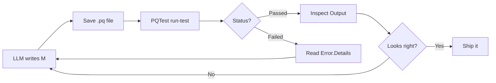

<!-- TODO: hero image — diagram of M file -> PQTest -> JSON -> LLM loop, or terminal screenshot of a passing PQTest run -->

## The problem

A teammate sent me a PBIX with a tangle of Power Query: four source tables, partial transformations, no shared keys, duplicated logic. The right answer was a clean star schema, and an LLM is the obvious tool to help draft that kind of refactor. The catch is that there is no clean way to let an LLM iterate on Power Query.

If you iterate inside a PBIX, every "show me what this produces" needs a refresh, which mutates the model the report sits on top of. Twenty iterations means twenty broken-or-weird intermediate states. The story for a published semantic model is worse, because refresh affects every consumer.

What I actually wanted was a way to evaluate M and inspect the output without applying it to anything downstream.

<!-- more -->

## What I tried first

My first thought was the [Power BI modeling MCP](https://github.com/microsoft/fabric-pbi-modeling-mcp), which can read and write a model's partitions and named expressions over the wire. I thought I could just point an LLM at it and iterate.

It is the right tool for *applying* a final change, but it does not solve the *iteration* part. The MCP edits the model, then I have to refresh the model to see what the M produced, which mutates the data the report sits on. I would have either had to spin up a throwaway PBIX for every iteration, or accept that my real one would be in a broken state for the duration. Neither is fun.

My second thought was a Fabric Dataflow Gen2 sandbox. The [public APIs](https://learn.microsoft.com/fabric/data-factory/dataflow-gen2-public-apis) let you push M definitions and trigger refreshes programmatically. That works, and it is what I ended up using for that specific PBIX (the M was destined to live in a service anyway), but the loop is slow (30 to 60 seconds per refresh) and there is no dry-run mode — `updateDefinition` always commits. You can dev/prod-split with a sandbox workspace, but that is overhead.

Then I went looking for something simpler.

## PQTest

If you have installed the [Power Query SDK extension](https://marketplace.visualstudio.com/items?itemName=PowerQuery.vscode-powerquery-sdk) in VS Code, you already have a CLI called `PQTest.exe` bundled inside it. It evaluates any `.pq` file headlessly and prints JSON.

The [official docs](https://learn.microsoft.com/power-query/sdk-tools/pqtest-overview) are mostly written for custom-connector authors, but the CLI works for any M expression — regardless of whether it is going to end up in a PBIX, a semantic model, a dataflow, or a notebook. The destination does not matter; you can iterate on the transformation first and pick where it lives after.

Install it:

```bash
code --install-extension PowerQuery.vscode-powerquery-sdk
```

The binary lands at a path like:

```text
%USERPROFILE%\.vscode\extensions\powerquery.vscode-powerquery-sdk-0.7.1-win32-x64\.nuget\Microsoft.PowerQuery.SdkTools.2.154.1\tools\PQTest.exe
```

(Versions change; the pattern is stable.)

## Hello world

```powershell title="hello.pq"
let
    Source = #table({"id", "name", "score"}, {
        {1, "Alice",   95},
        {2, "Bob",     82},
        {3, "Charlie", 77}
    }),
    Filtered = Table.SelectRows(Source, each [score] > 80)
in
    Filtered
```

```powershell
& $pqtest run-test -q .\hello.pq -p
```

Returns:

```json
[{
  "Status": "Passed",
  "RowCount": 2,
  "Output": [
    {"id": 1, "name": "Alice", "score": 95},
    {"id": 2, "name": "Bob",   "score": 82}
  ]
}]
```

About a second. No PBIX, no Desktop, no model touched.

## Talking to real data

For anything that hits a remote source, you have to register a credential. For a Fabric warehouse with Entra auth, I grab a token from Az PowerShell and inject it as an `OAuth2` credential:

<!-- TODO: screenshot — terminal output of PQTest running against a warehouse, showing real rows in the Output array -->

```powershell
Import-Module Az.Accounts
$token = (Get-AzAccessToken -ResourceUrl "https://database.windows.net").Token

$cred = @{
  AuthenticationKind = "OAuth2"
  AuthenticationProperties = @{
    AccessToken = $token
    Expires     = (Get-Date).AddHours(1).ToString("r")
    RefreshToken = ""
  }
  PrivacySetting = "None"
  Permissions    = @()
} | ConvertTo-Json -Depth 5

$cred | & $pqtest set-credential -q .\warehouse-query.pq
```

PQTest stores the credential in `%LOCALAPPDATA%\Microsoft\PQTest\credentials.bin`, encrypted with Windows DPAPI tied to your user account. Same security model as Windows Credential Manager — fine to leave on disk between runs, only readable by you.

After that, `run-test` actually hits the warehouse and returns rows. About four seconds end-to-end.

## What makes this useful for an LLM

When the query fails, PQTest gives back a structured error that an LLM can parse and self-correct on.

**Syntax error** — exact line and column:

```json
{"Status": "Failed", "Error": { "Message": "Token Literal expected. Start position: (2, 134)..." }}
```

**Runtime error** — the failing key AND what the available alternatives look like:

```json
{
  "Status": "Failed",
  "Error": {
    "Message": "The key didn't match any rows in the table.",
    "Details": {
      "Key": "[Schema = \"X\", Item = \"DOES_NOT_EXIST\"]",
      "Table": "#table({\"Name\",\"Schema\",\"Item\",\"Kind\"}, {...})"
    }
  }
}
```

**Type error** — operator, both types, both values:

```json
{
  "Status": "Failed",
  "Error": {
    "Message": "We cannot apply operator + to types Text and Number.",
    "Details": {"Operator":"+","Left":"hello","Right":5}
  }
}
```

The LLM can fix and retry without another round trip to clarify. That is the part that makes the loop work.

## The loop



A typical inner loop is a few seconds. For the user-group consolidation work, the LLM landed the final transformation in about 20 iterations over maybe ten minutes of wall time. The source PBIX was never touched.

## Where the result lives

PQTest is the iteration tool. When the M is good, you still need to put it somewhere it runs in production. Three sensible options, depending on what you are doing:

- **Push it into a PBIX or semantic model** via the modeling MCP's named-expression and partition operations
- **Publish it as a Fabric Dataflow Gen2** if it needs to be shareable, scheduled, or queried by multiple consumers
- **Have your PBIX connect to a published dataflow** if you want one canonical source feeding several reports

The point is that iteration is decoupled from where the M finally lives. Test fast and locally, decide on the destination last.

## Bonus: PQTest in CI

The same CLI runs in build pipelines. Pre-deploy validation, regression tests using `PQTest compare` against an expected `.pqout` file, schema contracts — all worth wiring up if your team treats Power Query like real code.

## What I'm shipping with this post

Code samples are in the [resources folder for this post on GitHub](https://github.com/DAXNoobJustin/daxnoob.blog/tree/main/resources/iterating-on-power-query-with-an-llm) — the `.pq` files including the failing examples, a credential bootstrap script, a wrapper that pretty-prints results, and the prompt I use to drive the loop with an agent.

## Wrapping Up

The friction of "I need to refresh the model to see what my Power Query produces" has been baked into how we work with Power Query for so long that it took an LLM use case to make me look for something better. PQTest was the answer the whole time, bundled inside a VS Code extension most of us only ever use when writing a custom connector.

If your team is doing anything serious with Power Query, give it a try. Even without an LLM in the loop, just being able to evaluate an M expression and see the output without a model attached is a nice quality-of-life improvement.

Like always, if you have any questions or feedback, please reach out. I'd love to hear from you!
