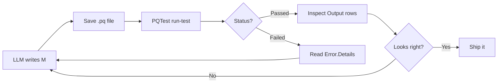

<!-- TODO: hero image - something like a diagram of "M file -> PQTest -> JSON -> LLM -> M file" loop, or a screenshot of a clean PQTest JSON success response next to a clean failure response -->

## The problem

A teammate sent me a PBIX recently. The Power Query was a tangle: four source tables, partial transformations that did not quite line up, duplicated logic across queries, no shared key between sources. We agreed the right answer was a clean star schema, but getting there meant rewriting the M from scratch and iterating until it produced what we expected.

This is a perfect job for an LLM. Describe the transformation, let it write the M, look at the output, give it feedback, repeat.

Except there is no clean way to do that in Power BI.

<!-- more -->

If I iterate inside Power BI Desktop, every "let me see what this produces" requires a refresh, which mutates the model the report sits on top of. If the M is half-broken (which it will be, during iteration), the report on top of it shows broken data. Twenty iterations means twenty broken-or-weird intermediate states staring back at me.

The published-model story is worse. Refreshing a single partition in a shared semantic model affects every report and every user looking at it. You cannot iterate on Power Query against a live model without breaking things for everyone.

What I actually need is a way to **evaluate M and inspect the output without applying it to anything downstream**. Just hand it a `.pq` file, get back the rows it would produce, and let me iterate.

## What I tried first (and why it was wrong)

My first instinct was to use the [Power BI modeling MCP](https://github.com/microsoft/fabric-pbi-modeling-mcp) to programmatically edit the model's named expressions and partitions. That worked for *applying* changes, but it has the same fundamental problem: testing the M means refreshing, refreshing mutates the model, mutating the model breaks the report. The MCP is a great tool for the deploy step, but it doesn't solve the iteration step.

My second thought was to spin up a Fabric Dataflow Gen2 as a sandbox: copy the M into a dataflow, iterate via the [Dataflow Gen2 public APIs](https://learn.microsoft.com/fabric/data-factory/dataflow-gen2-public-apis), then port back to the PBIX. That actually worked for our specific problem (the M was going to live in a service anyway), but it's a heavy setup if all you want is to validate a transformation. Each refresh was 30-60 seconds, which is fine for a few iterations but rough for tight loops.

Then I went looking for something simpler and found a CLI tool I had not known about.

## PQTest

If you have ever installed the Power Query SDK for VS Code, you already have it. Buried inside the extension is a binary called `PQTest.exe` that evaluates `.pq` files headlessly and prints JSON.

<!-- TODO: screenshot showing the extension installed in VS Code -->

The official docs are written for custom-connector authors, so it took me a minute to realize that the CLI is general-purpose. You can hand it any M expression in a `.pq` file and it will evaluate it against real data sources and return the result.

Install it:

```bash
code --install-extension PowerQuery.vscode-powerquery-sdk
```

It lives at a path like:

```text
%USERPROFILE%\.vscode\extensions\powerquery.vscode-powerquery-sdk-0.7.1-win32-x64\.nuget\Microsoft.PowerQuery.SdkTools.2.154.1\tools\PQTest.exe
```

(Version numbers change, but the path pattern is stable.)

## Hello world

The simplest test, no data source needed:

```powershell title="hello.pq"
let
    Source = #table({"id", "name", "score"}, {
        {1, "Alice", 95},
        {2, "Bob", 82},
        {3, "Charlie", 77}
    }),
    Filtered = Table.SelectRows(Source, each [score] > 80)
in
    Filtered
```

Run it:

```powershell
& $pqtest run-test -q .\hello.pq -p
```

Output:

```json
[
  {
    "Status": "Passed",
    "RowCount": 2,
    "Output": [
      {"id": 1, "name": "Alice", "score": 95},
      {"id": 2, "name": "Bob",   "score": 82}
    ]
  }
]
```

About a second to evaluate. No PBIX, no Desktop, no model.

## Talking to real data

For anything that hits a remote source, you have to register a credential first. The flow is: tell PQTest what data source the query needs (it reads it from the query file), generate a credential template, fill it in, pipe it back into `set-credential`.

For our team's Fabric warehouse (SQL with Entra auth), I grab a token from Az PowerShell and inject it as an `OAuth2` credential:

```powershell
Import-Module Az.Accounts
$token = (Get-AzAccessToken -ResourceUrl "https://database.windows.net").Token

$cred = @{
  AuthenticationKind = "OAuth2"
  AuthenticationProperties = @{
    AccessToken  = $token
    Expires      = (Get-Date).AddHours(1).ToString("r")
    RefreshToken = ""
  }
  PrivacySetting = "None"
  Permissions    = @()
} | ConvertTo-Json -Depth 5

$cred | & $pqtest set-credential -q .\warehouse-query.pq
```

After that, the same `run-test` command actually hits the warehouse:

<!-- TODO: screenshot of terminal output - PQTest run-test against the warehouse showing real rows -->

```json
[
  {
    "Status": "Passed",
    "RowCount": 5,
    "Output": [
      {"GroupId": 38219664, "GroupName": "Stockholm SQL",         "Country": "Sweden"},
      {"GroupId": 36899650, "GroupName": "Vienna Data and AI Meetup", "Country": "Austria"},
      ...
    ]
  }
]
```

Took about four seconds end-to-end for a five-row sample.

## The part that makes this useful for an LLM

When the query fails, PQTest gives you a structured error response that's basically purpose-built for an LLM to parse and self-correct.

Three flavors I exercised:

### Syntax error

```json
{
  "Status": "Failed",
  "Error": { "Message": "Token Literal expected. Start position: (2, 134). End position (2, 135)." }
}
```

Exact line and column. The LLM can jump straight to the bad character.

### Runtime error (bad table reference)

```json
{
  "Status": "Failed",
  "Error": {
    "Message": "The key didn't match any rows in the table.",
    "Details": {
      "Reason": "Expression.Error",
      "Microsoft.Data.Mashup.ErrorCode": "10061",
      "Key": "[Schema = \"Tabular_PartnerCommunity\", Item = \"DOES_NOT_EXIST\"]",
      "Table": "#table({\"Name\", \"Data\", \"Schema\", \"Item\", \"Kind\"}, {})"
    }
  }
}
```

The error tells the LLM what it asked for AND what the available alternatives look like. It can pick the right table name on the next iteration without needing another round trip.

### Type error

```json
{
  "Status": "Failed",
  "Error": {
    "Message": "We cannot apply operator + to types Text and Number.",
    "Details": {
      "Operator": "+",
      "Left": "hello",
      "Right": 5
    }
  }
}
```

Operator, both types, and the actual values that collided. As good as compiler errors get.

## The iteration loop



A typical inner loop is 1-5 seconds. For our user-group consolidation work, the LLM landed the final transformation in about 20 iterations, total maybe ten minutes of wall time. The PBIX and any reports on top of it were never touched until the M was ready.

## A prompt that works well

> I have a Power Query M expression I want to test. Use PQTest CLI to evaluate it headlessly.
>
> 1. Write the M to `.\test.pq`
> 2. Run `PQTest.exe run-test -q .\test.pq -p` and capture the JSON output
> 3. If `Status == Failed`, read `Error.Message` and `Error.Details`, propose a fix, write the corrected M, and re-run
> 4. If `Status == Passed`, show me the first 5 rows of `Output` and confirm the column shape matches what I asked for
>
> Loop until passing. Show the M diff between iterations.

You can drop this into Copilot CLI, Claude Code, or any agent that can run shell commands.

## Where this fits in a bigger workflow

PQTest is for the **iteration** stage. Once the M is good, you still have to put it somewhere it can run for production refreshes. There are three sensible places, and they're complementary:

| When the M needs to | Use |
|---|---|
| Power a single PBIX or semantic model | Push it back into the model via [Power BI modeling MCP](https://github.com/microsoft/fabric-pbi-modeling-mcp)'s `NamedExpression` and `Partition` tools |
| Live as a shareable, scheduled, queryable cloud asset | Publish it to a Fabric **Dataflow Gen2** (the [public APIs](https://learn.microsoft.com/fabric/data-factory/dataflow-gen2-public-apis) let you push the M definition programmatically) |
| Feed multiple PBIX files from one canonical source | Put it in a Dataflow Gen2 and have each PBIX connect to the dataflow's output |

The point is: iterate fast, locally, with no consequences. Decide where it lives last.

## Bonus: PQTest in CI/CD

The same CLI works in build pipelines. Some lightweight things you can wire up:

- **Pre-deploy validation**: every M expression in your repo gets a `run-test` before deployment. If any fail, block the merge.
- **Regression tests**: alongside each `.pq` file, keep a `.pqout` file with the expected first N rows. Use `PQTest compare` to flag drift.
- **Schema contracts**: a tiny `.pq` that returns column names and types, with an assertion that the shape matches what downstream consumers expect.

This is also where the dataflow-API path becomes interesting again. If your production M lives in a dataflow, you can:

1. Pull the current definition from the dataflow via `getDefinition`
2. Decode the M, run it through PQTest in CI
3. Push the validated definition via `updateDefinition`

That's a real CI/CD pattern, not just a developer convenience.

## Gotchas worth knowing

!!! warning "Public preview"
    The Power Query SDK and PQTest are still in public preview. The CLI flags are stable enough that I'd ship internal tooling on them, but expect minor changes.

!!! info "Token expiry"
    OAuth2 tokens from `Get-AzAccessToken` last about an hour. If your iteration loop runs longer, re-acquire the token and call `set-credential` again. A small helper script can wrap this.

!!! info "Connector subset"
    PQTest supports the connectors the SDK ships with. The big ones (SQL, Web, Json, Csv, OData, Excel) work. Some specialty connectors don't, and you'll only find out when you try.

!!! warning "Bad column refs return null, not errors"
    Standard Power Query behavior: `[ColumnThatDoesNotExist]` returns `null` instead of throwing. If you're testing a transformation that pulls fields by name, add an explicit shape check at the end of your query, or your "passing" result might be a bunch of nulls.

## What I'm shipping with this post

In the [resources folder](https://github.com/DAXNoobJustin/daxnoob.blog/tree/main/resources/iterating-on-power-query-with-an-llm) for this post:

- `hello.pq` — the trivial table example
- `warehouse-query.pq` — a real query against a Fabric warehouse
- `bad-syntax.pq`, `bad-runtime.pq`, `bad-types.pq` — the three failing examples for testing your error-handling
- `set-credential.ps1` — the credential bootstrap script
- `Invoke-PQTest.ps1` — a wrapper that finds PQTest, runs a query file, and pretty-prints the result
- `prompt-template.md` — the LLM prompt I use to drive the loop

## Wrap

The thing I keep coming back to is that **the friction of "I need to refresh the model to see what my Power Query produces" has been baked into how we work with Power Query for so long that it took an LLM use case to make me look for something better.** It turns out the answer was bundled inside a VS Code extension the whole time.

If your team is doing anything serious with Power Query, give PQTest a try. Even without an LLM in the loop, just being able to `run-test` an M expression and see the output is a quality-of-life improvement.
