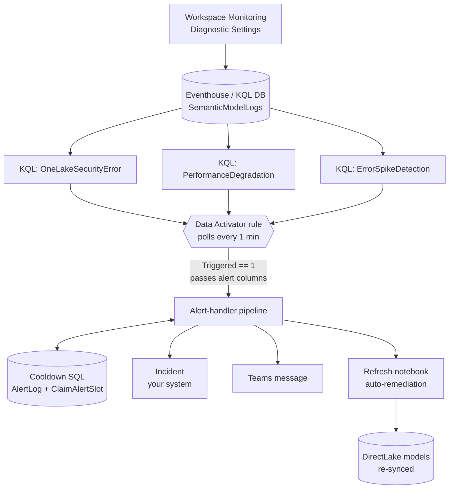

# Reliability — semantic-model monitoring, alerting & auto-remediation

> KQL detectors → Data Activator (1-minute cadence) → one Fabric pipeline →
> cooldown SQL → incident + Teams + **auto-refresh**. This is the "Observe"
> layer: how we know a production semantic model is unhealthy, and — for one
> class of failure — fix it before anyone is paged.

Everything here runs on **first-party Fabric surfaces** (Workspace Monitoring,
Eventhouse/KQL, Data Activator, Data Pipelines, Fabric SQL Database, Notebooks).
There is no external infrastructure to stand up.

---

## What you get

```
reliability/
├── README.md                         you are here
├── config.example.yml                placeholder → your-value wiring checklist
├── kql/
│   ├── OneLakeSecurityError.kql       OneLake security drift (auto-remediated)
│   ├── PerformanceDegradation.kql     P90 latency regression (Teams)
│   └── ErrorSpikeDetection.kql        elevated error rate (incident + Teams)
├── activator/
│   ├── ReflexEntities.json            Data Activator definition (the 1-min trigger)
│   └── README.md                      what the three Activator rules do
├── sql/
│   └── CreateAlertingSchema.sql       AlertLog table + cooldown stored procs
├── pipeline/
│   ├── DataActivatorAlertHandler.json      the alert-handler Data Pipeline
│   └── OneLakeSecurityProbeScheduler.json  runs the OneLake probe notebook (every minute)
└── notebooks/
    ├── RefreshSemanticModel.ipynb     XMLA refresh (auto, falls back to full)
    └── OneLakeSecurityProbe.ipynb     optional active probe (alternative trigger)
```

---

## Architecture



**One backbone, many consumers.** Workspace Monitoring streams every query,
refresh, error, and latency into a Fabric-managed Eventhouse (`SemanticModelLogs`).
The detectors are just KQL on top of that stream. You already have the data;
this is the alerting layer built on it.

**The Activator is the clock.** Each detector is wired to a Data Activator rule
that runs the KQL on a 1-minute cadence. When a detector returns a row with
`Triggered == 1`, the Activator starts the pipeline and maps the detector's
output columns onto the pipeline's parameters.

**Every detector emits the same shape** so a single pipeline handles all three:

| Column | Purpose |
|---|---|
| `Timestamp` | when the detector evaluated |
| `ItemName`, `ItemId` | the affected model (or a group sentinel) |
| `Triggered` | `1` fires the rule; `0` is filtered out (unless `_debug`) |
| `AlertType` | `ErrorSpike` \| `PerformanceDegradation` \| `OneLakeSecurityError` |
| `IncidentMessage`, `TeamsMessage` | preformatted HTML bodies the pipeline forwards |

---

## The three alerts

| Alert | Detects (KQL) | Incident | Teams | Auto-remediation |
|-------|---------------|:----:|:----:|------------------|
| **ErrorSpike** | elevated per-user error rate in 5-min windows | ✅ | ✅ | — |
| **PerformanceDegradation** | P90 latency ≥ 3× baseline **and** ≥ 10s, multi-user | — | ✅ | — |
| **OneLakeSecurityError** | OneLake permission/security errors | ✅ | ✅ | ✅ refresh |

The detectors are deliberately conservative — they gate on multi-user signal,
minimum sample sizes, and cooldown windows so they fire on *systemic* problems,
not one user's bad slicer. Read the `let` variables at the top of each `.kql`
file; they are the tuning surface.

---

## How one alert flows through the pipeline

The pipeline (`DataActivatorAlertHandler.json`) is intentionally small. On each
run it:

1. **Claims a cooldown slot** for each action it might take (incident / Teams /
   refresh) by calling `ClaimAlertSlot` in the SQL database. The claim is
   *atomic* — it both checks "did we already alert on this within the cooldown
   window?" and reserves the slot in one transaction, so the every-minute
   Activator cadence can't produce duplicate alerts or race two runs.
2. **Routes by `AlertType`:**

   | AlertType | Incident branch | Teams branch | Refresh branch |
   |---|:---:|:---:|:---:|
   | `ErrorSpike` | ✅ (incident **+** Teams) | — | — |
   | `PerformanceDegradation` | — | ✅ Teams only | — |
   | `OneLakeSecurityError` | ✅ (incident **+** Teams) | — | ✅ refresh |

3. **Logs every action** back to `AlertLog` via `UpdateAlertDetails`, filling in
   the incident link and outcome on the row the claim reserved.

### The cooldown / dedup design

`CooldownConfig` is a single pipeline parameter holding per-alert-type minutes:

```
@{ErrorSpike=30; PerformanceDegradation=30; OneLakeSecurityError=15}
```

Each cooldown lookup parses it by alert type and passes the right window to
`ClaimAlertSlot`. So OneLake errors can re-alert every 15 minutes while error
spikes hold for 30 — one parameter, no per-type plumbing. `ClaimAlertSlot`
returns `Claimed = 1` only to the first caller inside the window; later runs get
`Claimed = 0` and the pipeline's `If` conditions skip the action.

---

## The OneLake auto-remediation (the hero path)

DirectLake models read straight from OneLake. When a model's OneLake **security
version** drifts out of sync with the lakehouse, users start getting blocked:

> *We cannot process the request as we encountered a transient issue when trying
> to determine user permissions defined in OneLake. Please wait a few minutes
> and try again.*

A refresh re-syncs the security configuration and clears the error. So instead
of paging a human, the pipeline runs `RefreshSemanticModel.ipynb`, which issues
an `automatic` XMLA refresh across every monitored model (they share one
lakehouse, so they're refreshed as a group) and **falls back to a `full`
refresh** if the automatic one no-ops. The on-call just sees a green dashboard.

### Portable detection vs. the internal engine trace

The detector ships querying **`SemanticModelLogs`** — the table every customer
gets from Workspace Monitoring — using the exact user-facing phrase:

```kql
| where OperationName == "Error"
| where ItemId in (_modelIds)
| where EventText has "permissions defined in OneLake"
```

> ⚠️ Use the **exact phrase**, not a broad `has "OneLake"`. A broad match also
> catches request-router noise and user-cancelled queries and will false-positive.

Internally we *also* cross-reference the Analysis Services **engine trace**
(`ASTrace`), which exposes richer subtypes ("security configuration has changed",
"Universal security version mismatch error on artifact"). That trace comes from
an internal source not available to customers, so it is not
shipped here. The `SemanticModelLogs` signal above is the portable equivalent —
it's the error your users actually hit, and it's enough to drive remediation.

> This `SemanticModelLogs` detector was validated against a live production
> estate: it is a recurring signal across all monitored models. The exact phrase
> is stable; the ASTrace-only phrases never appear in `SemanticModelLogs`.

### Two ways to detect

| | KQL detector (shipped default) | Active probe notebook |
|---|---|---|
| File | `kql/OneLakeSecurityError.kql` | `notebooks/OneLakeSecurityProbe.ipynb` + `pipeline/OneLakeSecurityProbeScheduler.json` |
| Mechanism | reads `SemanticModelLogs` for *real user errors* | runs `EVALUATE TOPN(1, 'Calendar')` against each model and inspects the error |
| Latency | ~1 min (Activator cadence) | ~1 min (its scheduler pipeline runs the notebook every minute) |
| Pro | zero false work; sees real user impact | catches drift even with no user traffic |

Both end the same way: they trigger the pipeline with identical parameters. Pick
the KQL detector for "alert on real impact," add the probe if you want synthetic
coverage during quiet hours.

---

## Wiring it up

> Names below (`HelixFabric-*`, model names) are illustrative — substitute your
> own. Fill `config.example.yml` as you go; it's your checklist.

1. **Enable Workspace Monitoring** on the workspace hosting your models. This
   creates the Eventhouse with `SemanticModelLogs`. (Settings → Workspace
   monitoring.)
2. **Create the cooldown SQL database.** Create a Fabric SQL Database, then run
   `sql/CreateAlertingSchema.sql` against it (Go `sqlcmd` with
   `ActiveDirectoryDefault`, or the Fabric SQL query editor). Note its
   workspace + artifact GUIDs.
3. **Import the notebooks** (`notebooks/`) into the pipeline's workspace. In
   `RefreshSemanticModel.ipynb`, set `OneLakeModelIds` to your model GUIDs and
   `WorkspaceName` to the workspace hosting them.
4. **Import the pipeline** (`pipeline/DataActivatorAlertHandler.json`) and bind
   its connections (placeholders are listed in `config.example.yml` →
   `connections`): the Fabric SQL DB, Microsoft Teams, and your incident
   endpoint. Set the parameter defaults (`AlertingDbWorkspaceId`,
   `AlertingDbArtifactId`, `IncidentOwningTeam`, `CooldownConfig`, …) and point the
   "Refresh Semantic Model" activity at the imported notebook.
5. **Create the detectors + Activator.** Add each `kql/*.kql` query and set
   `_modelIds` (OneLake) to your model GUIDs. Wire each to a **Data Activator**
   rule that runs the query every minute and, on `Triggered == 1`, starts the
   pipeline, wiring the alert's columns (`ItemName`, `ItemId`, `AlertType`,
   `IncidentMessage`, `TeamsMessage`) onto the pipeline parameters **in the
   Activator UI**. `activator/ReflexEntities.json` is the exported, cleaned
   definition of the rule *shape* (three rules, each → the handler pipeline) —
   import it and rewire the placeholder references (and set the column→parameter
   mapping in the UI), or use it as a model. See [`activator/README.md`](activator/README.md).
   *(Optionally also schedule `pipeline/OneLakeSecurityProbeScheduler.json` to
   run the active probe notebook on the same cadence.)*
6. **Smoke-test** by setting `_debug = true` at the top of a detector: it emits a
   row even with no real errors, so you can confirm the Activator → pipeline →
   Teams/SQL path end-to-end. Set it back to `false`.

---

## Customizing

- **Add a detector.** Write a KQL query that emits the standard columns
  (`Timestamp, ItemName, ItemId, Triggered, AlertType, IncidentMessage, TeamsMessage`),
  add an `AlertType` to `CooldownConfig`, and wire a new Activator rule. The
  pipeline already handles any alert type that routes to incident/Teams; add an
  `If` branch only if it needs a new action.
- **Swap the incident system.** We call the incident system via an Azure Function (a Key Vault
  "get secret" → Web "POST create-incident" pair). Replace that pair with your
  incident system's API (ServiceNow, PagerDuty, …), **or** delete the incident
  branch entirely and keep Teams + auto-refresh. The portal-link construction in
  `Set IncidentLink` is the only other incident-specific bit.
- **Tune thresholds & cooldowns.** Thresholds live in the `let` block of each
  `.kql`; cooldown windows live in the `CooldownConfig` pipeline parameter.

---

## Provenance

Cleaned and anonymized from an internal Microsoft Fabric reliability system for
public release. GUIDs, endpoints,
and chat identifiers are placeholders; the detection logic, cooldown design, and
remediation flow are faithful to the production system.
